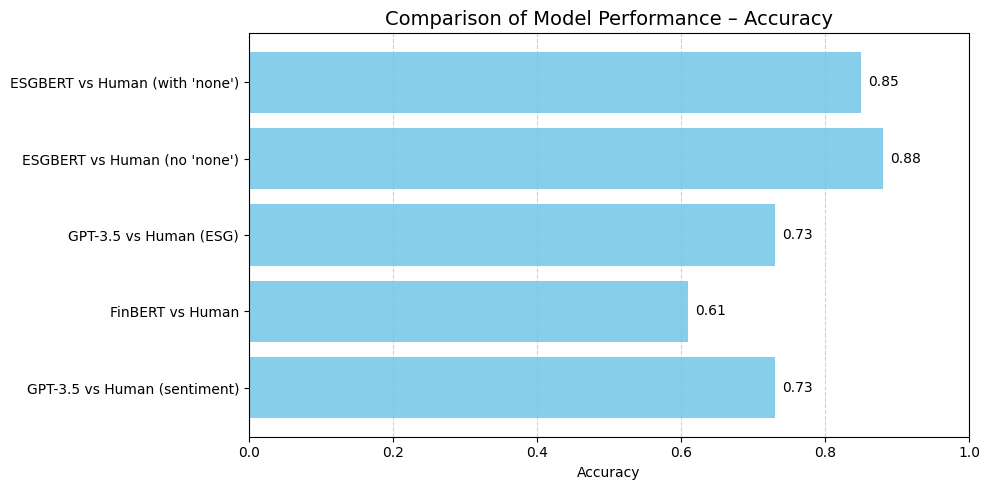

# AI-for-ESG

## Phase 0 – Data Collection 📁

This project begins with the manual construction of a high-quality document corpus based on **publicly available corporate information** from companies listed in the **Swiss Market Index (SMI)**. To ensure data consistency and feasibility, we focus on the **top 10 SMI companies by market capitalization**, over the **2021–2023** period. These three years provide a sufficiently recent and rich dataset, with wide availability of sustainability and governance disclosures.

### 🔍 Selected Sources of Information

The dataset includes the following document types, which are commonly used in ESG assessments and financial analysis:

- **Annual Reports**  
- **Half-Year Reports**  
- **Sustainability Reports**  
- **Integrated Reports** (when available)  
- **Corporate Governance Reports**  
- **Earnings Call Transcripts & Fireside Chats**

The goal is to rely on **complete, public, and comparable documents** as the foundation for all subsequent analyses.

### ⚠️ Why the Collection Was Done Manually

Although web scraping was initially considered, it quickly proved unreliable and inefficient due to the following issues:

- Each company has a unique website structure and navigation logic.
- Report titles and formats vary widely (e.g. *“Integrated Report”*, *“Creating Shared Value Report”*, *“Sustainability Highlights”*, etc.).
- Some websites load documents dynamically via JavaScript, making traditional scraping tools ineffective.
- Links to PDF files are often not directly accessible in the initial HTML.
- Document classification is inconsistent (e.g. a 2023 report might be listed under a 2024 tab).
- Multilingual content (e.g. Holcim: English titles, German content).
- Certain companies split reports across multiple categories (e.g. Swiss Re separates Business, Financial, and Sustainability reports).

✅ **Conclusion**: Manual collection ensured better reliability, completeness, and clarity.

### 🔊 Investor Communications and Earnings Call Transcripts

To complement the reports, I manually downloaded a diverse set of **transcripts from investor relations materials**, including **earnings calls**, **fireside chats**, and **Q&A sessions**. These materials are typically less polished and less controlled than formal sustainability or annual reports, making them particularly useful for more **objective ESG analysis**.

Unlike sustainability reports — which are often heavily curated for branding and compliance — investor communications respond directly to questions from analysts and stakeholders. This interactive nature makes them **less susceptible to greenwashing or corporate spin**, providing a more transparent view of a company’s priorities and risk management.

- Primary source: each company’s **Investor Relations** webpage (when available)
- Secondary source: **Seeking Alpha** (via a 28-day trial account) to supplement missing transcripts
- **Presentations were excluded**: they tend to be scripted and overly promotional
- Focus was placed on unscripted, **conversational formats** such as Q&A exchanges and analyst briefings

Due to **legal and technical limitations**, transcripts were collected manually. Automated scraping was not feasible: Seeking Alpha explicitly prohibits it in their [Terms of Use](https://seekingalpha.com/page/terms-of-use), and they implement active anti-scraping protections.

### 🗂️ File Organization & Metadata

All documents were stored in a structured folder on **Google Drive**.

To manage and track the collection process, I created two complementary metadata tables:

- **Sheet 1 – Presence Matrix**: overview of document availability by `Company × Year`, using Boolean indicators.
- **Sheet 2 – Document Register**: detailed information per file, including file name, type, and path.

The two sheets are linked by a unique `(Company, Year)` key.

### 📈 Coverage Summary

The table below summarizes the coverage status for the top 10 SMI companies (2021–2023). Most reports and transcripts were successfully collected. A few gaps remain, particularly for some quarterly earnings calls (e.g. Roche Q3 2021, Lonza Q3 2023).

| Company   | Reports Collected | Earnings Calls Collected |
|-----------|--------------------|---------------------------|
| Nestlé    | ✅                 | ✅                        |
| Novartis  | ✅                 | ✅                        |
| Roche     | ✅                 | ⚠️ Missing Q3 2021, Q1 2022 |
| Richemont | ✅                 | ⚠️ Missing Q1/Q3 all years |
| ABB       | ✅                 | ✅                        |
| Zurich    | ✅                 | ⚠️ Missing Q3 2021        |
| UBS       | ✅                 | ✅                        |
| Holcim    | ✅                 | ⚠️ Missing Q1/Q2/Q3 2021 and Q1 2022 |
| Swiss Re  | ✅                 | ✅                        |
| Lonza     | ✅                 | ⚠️ Missing Q1/Q3 for 2021, 2022, 2023 |

---

For the missing transcripts, I thoroughly searched across all available sources, including Investor Relations websites, Seeking Alpha, and other financial platforms. I also contacted someone with **Bloomberg Terminal access** (which has extensive coverage), but even there, the transcripts were unavailable. My working hypothesis is that **these earnings calls simply did not take place** — in **Switzerland**, unlike the **United States**, listed companies are **not legally required to hold four earnings calls per year**. Quarterly disclosures are common, but not mandatory or standardized.

➡️ *Source: SIX Swiss Exchange – [Periodic Reporting Requirements](https://www.ser-ag.com/en/topics/regular-reporting.html#:~:text=Compliance%20with%20the%20regular%20reporting,for%20issuers%20of%20other%20securities.)*

This manual collection phase lays the foundation for all subsequent analysis. The next step involves organizing these files into a structured dataframe with standardized metadata.

👉 Proceed to [Phase 1 – Dataset Construction](#phase-1--dataset-construction-🧱)


## Phase 1 – Dataset Construction 🧱

> 📁 **Note on data availability**  
Due to file size limitations and copyright considerations, the raw PDF documents (annual reports, earnings call transcripts, etc.) are **not included in this repository**.  
However, all files used in this project are publicly available online on the official investor relations websites of the selected companies.  
For convenience and reproducibility, **copies of all documents are stored in a private Google Drive folder** and are accessed programmatically (see paths in the code).

In this first notebook, I construct the core dataset used for analysis by combining two sources:

1. A manually downloaded collection of PDF documents (annual reports, sustainability reports, transcripts, etc.) stored on Google Drive.
2. An Excel file containing structured metadata for the top 10 SMI companies.

### 🗂️ File Parsing and Metadata Extraction

I programmatically traverse each company's folder in Drive and extract metadata for every `.pdf` file:
- **Company** (from folder structure)
- **Year** (from file name or path)
- **Document Type** (inferred from filename keywords)
- **Document Title**
- **File Path**

A preview of the resulting dataset:

| Company                    | Year | Document Type     | Document Title                     | Path                                                                                      |
|----------------------------|------|-------------------|------------------------------------|-------------------------------------------------------------------------------------------|
| Zurich Insurance Group AG  | 2023 | Annual Report     | Zurich_Annual_Report_2023.pdf      | /content/drive/MyDrive/Thèse Master/Data/Zurich Insurance Group AG/Zurich_Annual_Report_2023.pdf |
| Zurich Insurance Group AG  | 2023 | Half-Year Report  | Zurich_Half_Year_Report_2023.pdf   | /content/drive/MyDrive/Thèse Master/Data/Zurich Insurance Group AG/Zurich_Half_Year_Report_2023.pdf |
| Zurich Insurance Group AG  | 2022 | Annual Report     | Zurich_Annual_Report_2022.pdf      | /content/drive/MyDrive/Thèse Master/Data/Zurich Insurance Group AG/Zurich_Annual_Report_2022.pdf |

This structured DataFrame is used to match each document with financial and ESG metadata (tickers, industry classification) in the next step.

---

### 📄 Complementary Metadata Table

Each document is also described in a second table that includes external metadata, such as tickers, industry classification, and download information.

| Company     | Year | Ticker SMI | Ticker Seeking Alpha (US) | Ranking per Cap | SASB Industry     | Document Type     | Document Title       | Source        | Source URL                                                        | Format | Scrapable via Google | Saved Local |
|-------------|------|-------------|----------------------------|------------------|--------------------|--------------------|------------------------|----------------|-------------------------------------------------------------------|--------|-----------------------|-------------|
| Nestlé SA   | 2023 | NESN        | NSRGY                     | 1                | Food & Beverage    | Annual Report      | Annual Review         | Nestlé Website | https://www.nestle.com/investors/publications                    | PDF    | No                    | Yes         |
| Nestlé SA   | 2023 | NESN        | NSRGY                     | 1                | Food & Beverage    | Half-Year Report   | Half-Year Report      | Nestlé Website | https://www.nestle.com/investors/publications                    | PDF    | No                    | Yes         |

---

### 🔗 Metadata Merge

The extracted document data is then merged with the Excel file, matching each `(Company, Year)` pair.  
The Excel metadata includes:
- Company tickers (SMI and Seeking Alpha)
- SASB industry classification

Before merging, I performed several standardization steps to ensure consistency and avoid mismatches:
- Standardized company names (e.g. `Nestle` vs `Nestlé`)
- Converted year values to strings
- Normalized accents (e.g. `é` → `e`)

After merging, I removed perfect duplicates based on core metadata fields to ensure a clean dataset.

📄 **Output file**: `df_merged_clean.csv`  
This file is saved in Drive and serves as the input for the next phase of the project:  
**[Phase 2 – PDF Text Extraction and Preprocessing](#phase-2--text-extraction--pre-processing-🧪)**

> 💡 The full source code for this metadata cleaning and merge process is available in the notebook:  
> [`1_Thesis.ipynb`](./Notebooks/1_Thesis.ipynb)

## Phase 2 – Dataset Exploration 🔍

In this phase, I perform an exploratory analysis of the merged dataset created in [Phase 1](#phase-1--dataset-construction-🧱). The goal is to verify data completeness, detect missing entries, and understand the distribution of document types.

### 🧮 Key Analyses

- **Total number of documents** per company and year  
- **Distribution of document types** (e.g. Annual Report, Sustainability Report, etc.)  
- **Pivot table** to visualize which types are available for each company-year combination  
- **Gap detection** to identify missing reports or transcripts  

A sample of the pivot table below shows how many documents of each type were collected for ABB Ltd between 2021 and 2023:

| Company | Year | Annual Report | Earnings Call Transcript | Governance Report | Half-Year Report | Integrated Report | Sustainability Report |
|---------|------|----------------|----------------------------|--------------------|-------------------|--------------------|------------------------|
| ABB Ltd | 2021 | 1              | 4                          | 0                  | 0                 | 0                  | 1                      |
| ABB Ltd | 2022 | 0              | 4                          | 1                  | 0                 | 1                  | 1                      |
| ABB Ltd | 2023 | 0              | 4                          | 1                  | 0                 | 1                  | 1                      |

This overview ensures the corpus is both **comprehensive and well-documented** before proceeding to the text extraction phase.

👉 For details and full visualizations, see the notebook [`2_Thesis.ipynb`](Notebooks/2_Thesis.ipynb).

### 🧠 Phase 3 – Sentence Extraction (NLP-ready)

This step is the most **crucial foundation** for the NLP classification phase. It involves extracting clean, meaningful, and self-contained sentences more than 200 corporate documents (Annual Reports, ESG Reports, etc.).

To achieve this, I built a sentence extraction pipeline using:

- [**PyMuPDF**](https://pymupdf.readthedocs.io/en/latest/): a fast and lightweight PDF parser that allows page-by-page access and precise text extraction from complex layouts.
- [**spaCy**](https://spacy.io/): a powerful industrial-strength NLP library that handles sentence segmentation, tokenization, and linguistic filtering.

Each document is parsed **page by page**, applying a series of custom cleaning operations:

- **Removal of repeated headers and footers** (e.g. company name, year, page numbers)
- **Exclusion of index pages** (detected using pattern frequency heuristics)
- **Sentence segmentation** with spaCy
- **Filtering out** short, noisy, numeric-only, or symbol-heavy text chunks

The resulting sentences were then saved to CSV for further processing.

Due to the complexity of the documents and the amount of layout noise, **this step took over 30 minutes to run** and had to be repeated **entirely from scratch**. Initially, I proceeded with the pipeline, assuming the extraction quality was sufficient. However, at the NLP classification stage, I noticed that the results were poor — many "sentences" were in fact titles, footers, page numbers, or table of contents entries that had been incorrectly parsed as meaningful content.

This significantly degraded model performance and introduced semantic noise. As a result, I had to go back to this sentence extraction phase, rebuild the cleaning logic, and reprocess **all documents again**, which took time but drastically improved the output quality. This experience highlighted how **crucial and foundational** this stage is for the success of the entire NLP pipeline: if sentence quality is poor, no downstream analysis can be trusted.

➡️ For full implementation details, see the notebook: [`3_Thesis.ipynb`](Notebooks/3_Thesis.ipynb)

### 🧠 Phase 4 – ESG Sentence Classification Using Transformer Models

This notebook performs sentence-level classification across all extracted company reports to assign ESG labels — **Environmental**, **Social**, **Governance**, or **None** — to each sentence.

We follow the methodology from [Tobias Schimanski's tutorial on Medium](https://medium.com/@schimanski.tobi/analyzing-esg-with-ai-and-nlp-tutorial-1-report-analysis-towards-esg-risks-and-opportunities-8daa2695f6c5), which is based on his academic paper:

> *“Bridging the gap in ESG measurement: Using NLP to quantify environmental, social, and governance communication”*  
> *Tobias Schimanski et al., 2023*

We use the **ESGBERT transformer models**, available from HuggingFace ([ESGBERT models repository](https://huggingface.co/ESGBERT)), which are fine-tuned BERT-based classifiers trained specifically to detect ESG content. Three separate models are loaded:
- `EnvironmentalBERT` for environmental content,
- `SocialBERT` for social-related content,
- `GovernanceBERT` for governance themes.

Each sentence is passed through all three models. Each model returns:
- a **label** (either the target class or `"none"`),
- and a **confidence score** between `0` and `1`.

#### 🔍 How the classification works

For each sentence:
- If the model predicts a relevant ESG category (e.g. `"environmental"`, `"social"`...), it returns a confidence score for that label.
- If no category surpasses a **confidence threshold of 0.5**, the sentence is assigned the label `"none"`.
- A **majority label** (or more precisely, the label with the highest score above 0.5) is then computed across the three categories.

Example result:

| company                   | year | document_type       | sentence                                                                                                                                                       | label_env   | score_env | label_soc | score_soc | label_gov | score_gov |
|---------------------------|------|----------------------|----------------------------------------------------------------------------------------------------------------------------------------------------------------|-------------|-----------|-----------|-----------|-----------|-----------|
| Compagnie Financière Richemont | 2022 | Sustainability Report | Chaired by dunhill’s CEO, the newly appointed Sustainability Committee ensures the implementation of Richemont’s strategy across the business... | environmental | 0.989977  | social    | 0.996938  | none      | 0.774423  |

This approach ensures that **each sentence is independently evaluated** for its ESG relevance, allowing nuanced and overlapping classifications.

#### 🧱 Batching for Large-Scale Classification

With **over 200,000 sentences** to classify, we split the dataset into **batches of 10,000** sentences for processing. This prevents memory overflow and allows intermediate saving of results. The batch loop:
1. Loads a slice of the data.
2. Applies the three ESG classifiers.
3. Saves the result to a dedicated folder in Google Drive.

After all batches are processed, they are concatenated into a single file and a final label column is assigned based on dominant confidence scores.

#### ⚙️ Running on GPU to Save Time (and Money)

Running transformer models is computationally intensive. Fortunately, Google Colab occasionally offers **free GPU access**. I was able to access a GPU for this classification step, which brought the total runtime down to just over **1 hour**.

Without GPU, this task would likely take several **hours or even days**, depending on hardware. However, after using the GPU for one full classification session, it became unavailable for the rest of the day — highlighting the **budgetary and infrastructural constraints** of this kind of academic project.

#### 🧵 Full Code Available

The entire classification pipeline — loading models, batching, applying prediction, and saving results — is detailed in  
📓 [`4_Thesis.ipynb`](Notebooks/4_Thesis.ipynb)

## 🧪 Phase 5 – ESG Classification Analysis

This  step analyzes the ESG sentence-level classifications obtained from the previous stage (`Thesis 4`). The goal is to produce insightful descriptive statistics and visualizations by company, year, and document type.

### 🗂️ Dataset Structure

Each row in the dataset corresponds to a sentence extracted from a document (report or earnings call), along with its ESG classification labels and associated confidence scores (between 0 and 1) for Environmental, Social, and Governance pillars.

Key columns include:
- `company`, `year`, `doc_type`
- `sentence`: raw sentence text
- `label_env`, `score_env`
- `label_soc`, `score_soc`
- `label_gov`, `score_gov`

---

### 🧮 Global Classification Breakdown

Each sentence is assigned to a **classification type** based on whether one or more pillars have a confidence score > 0.9. The breakdown is as follows:
- `E`, `S`, or `G`: when exactly one pillar is confidently dominant
- `multi (2)` or `multi (3)`: when two or all three labels are simultaneously strong
- `none`: when the classification is "none", or when no score exceeds the 0.9 threshold

📊 **Distribution of classification types** (with score > 0.9):


> 🔍 Most sentences are classified as `none`, so not ESG related. Among valid ESG sentences, Environmental classifications appear most frequently, followed by Social and Governance. Multi-label sentences are present.

---

### 📄 Sentence Volume by Document Type

The dataset contains sentences from various types of documents (Annual Reports, ESG Reports, Earnings Calls...).

📊 **Total number of sentences per document type**:


> 🧾 **Annual Reports** clearly dominate in terms of extracted sentence volume, followed by **Earnings Call Transcripts**. This reflects the length and density of these documents. **Sustainability Reports** are significantly shorter in comparison. Governance-specific and Half-Year reports contribute marginally to the overall corpus.
>
> However, this distribution is **not uniform across companies**. Some firms, such as Nestlé or UBS, publish multiple earnings call transcripts per year—sometimes including additional materials like fireside chats or analyst sessions—while others provide fewer or none. This heterogeneity impacts the total number of sentences extracted per document type and should be considered when comparing across firms.---

### 🏢 Sentence Counts by Company

📊 **Total number of extracted sentences by company (including non-ESG)**:


> This chart displays the total number of extracted and processed sentences per company, regardless of ESG classification. It includes all sentences, even those not assigned to any ESG category (i.e. labelled as "none").
>
> UBS, Nestlé, and Swiss Re show the highest overall sentence counts. These differences may reflect disparities in the number, length, and structure of reports published by each firm. For example, some companies release multiple types of documents (annual, sustainability, earnings calls) per year, while others offer fewer disclosures or shorter materials.

---

## 📈 ESG Sentence Share

This chart presents the **proportion of ESG-classified sentences (score > 0.9)** over the **total number of sentences** for each company. It helps compare the relative prominence of ESG content in corporate disclosures, regardless of total document volume.

📊 **Proportion of ESG sentences per company**:

.png)

> 🧮 This metric controls for differences in report length or number of documents. Holcim and ABB stand out with the highest shares of high-confidence ESG content, suggesting a relatively strong ESG signal density across their documents.
>
> 🧪 Conversely, Novartis and Roche have large corpora but a smaller relative share of ESG-classified sentences. This could reflect either less ESG-oriented language or greater content volume outside ESG topics (e.g., scientific or operational reporting).
>
> ⚠️ Important: this figure captures **the presence of ESG-related communication**, not its sentiment or tone. A company may discuss ESG issues in a critical, defensive, or neutral way — high proportions do not necessarily mean strong ESG performance or commitment.
>
> 🔍 Lastly, the use of a 0.9 threshold ensures high precision in classification, but may exclude more nuanced or indirect ESG references that fall below this confidence level.

##  Dominant Label Overview (No Threshold)

Each sentence may receive multiple ESG labels (e.g., both Social and Governance) if it meets high confidence scores in more than one category. This makes sense conceptually, as some statements touch on cross-cutting themes — such as workplace ethics or climate governance — but it poses challenges when we later want to calculate pillar-specific ESG scores.

To avoid **double-counting** sentences in multiple pillars, we introduce a dominant label: the ESG class with the **highest individual confidence score** per sentence. This allows for clean aggregation and comparison across companies.

📊 **Dominant ESG label distribution by company** :

In this chart, each sentence is assigned a **dominant label** — the ESG category (Environmental, Social, or Governance) with the **highest classification score** (or not ESG), regardless of whether the score exceeds a threshold. This allows us to analyze how ESG topics are distributed across companies when we force a single label per sentence.

.png)

>
> 📌 The results vary significantly across companies:
> - **Holcim** and **Swiss Re** display a strong emphasis on Environmental topics.
> - **Nestlé**, **Richemont**, and **Roche** place greater focus on Social issues.
> - The remaining companies present a more balanced distribution across ESG pillars, although Governance consistently appears slightly less prominent.

> 🔍 Notably, many sentences still fall under the 'none' category (i.e., no ESG score exceeded any pillar-specific model), but this doesn’t mean the sentence was irrelevant — it simply wasn’t confidently ESG-tagged by the classifier.


##  📈 ESG Sentence Share

📊 **ESG label proportions by company **:

.png)

This chart shows the proportion of ESG-classified sentences over the total, but **based exclusively on each sentence's *dominant* label** — in other words, each sentence is counted **once**, according to its strongest ESG dimension (Environmental, Social, or Governance).

#### 🧭 Key Takeaways:
- **Holcim**, **ABB**, and **Swiss Re** remain the companies with the highest ESG communication ratios.
- However, several **ranking shifts** appear compared to the previous chart, which accounted for **multi-label classification** (where one sentence could contribute to multiple ESG categories):
  - **UBS Group AG** drops from **4th to 7th**,  
  - **Nestlé SA** falls from **5th to 8th**,  
  - **Lonza Group AG** rises from **7th to 5th**.

These changes highlight an important methodological point:  
➡️ **Using multi-label classification inflates ESG coverage** by counting the same sentence multiple times — once per label.  
➡️ In contrast, assigning only the dominant ESG label ensures **non-redundant, clearer attribution**, offering a more conservative and arguably more accurate estimate of ESG focus.

This distinction is crucial for fair comparisons across companies and for avoiding overestimation of ESG communication intensity.

### 📌 Conclusion

This section provided a comparative overview of ESG communication across major Swiss companies, based on the number and proportion of ESG-classified sentences. By switching from a multi-label view to a dominant-label approach, we observed meaningful changes in company rankings — underlining the importance of methodological consistency when interpreting ESG discourse.

📁 **For further analyses, full code, and dynamic breakdowns**, please refer to the notebook [`5_Thesis.ipynb`](Notebooks/5_Thesis.ipynb).

---

### Thesis 6 – Sentiment Analysis with FinBERT

In this phase, we enrich our ESG-classified sentences by applying **FinBERT**, a transformer-based model fine-tuned for financial sentiment analysis. This helps us not only classify the nature of ESG content (Environmental, Social, Governance), but also understand **how** companies talk about these topics — whether in a **positive**, **negative**, or **neutral** tone.

🔍 **What is FinBERT?**  
FinBERT is a domain-specific adaptation of [BERT](https://arxiv.org/abs/1810.04805), pre-trained on financial texts to detect sentiment more accurately in that context. It was developed by researchers at HKUST and is available via Hugging Face:  
👉 [yiyanghkust/finbert-tone](https://huggingface.co/yiyanghkust/finbert-tone)

💡 **Why do we use it here?**  
Traditional sentiment models may misinterpret financial or corporate jargon. FinBERT improves precision in our context (company reports, ESG disclosures) and allows us to measure **the tone of ESG-related discourse** for each firm. This can later be aggregated to derive **sentiment-based ESG scores**.

---

#### 📌 Overview of this notebook:

1. **Mount Google Drive & Load ESG Sentences**  
   We load the CSV from a previous step that contains all extracted sentences, and filter for those classified as ESG (either environmental, social, or governance).

2. **Load FinBERT with GPU Acceleration**  
   We use the Transformers library to load the FinBERT model and tokenizer. If a GPU is available in the Google Colab environment, inference becomes significantly faster.

3. **Run Sentiment Classification**  
   Each ESG sentence is passed through FinBERT to generate a sentiment score across three labels: `positive`, `negative`, and `neutral`. The label with the highest probability is selected as the predicted sentiment (`sent_label`).

4. **Export the Results**  
   The dataset, now enriched with sentiment scores, is saved for further steps.
---

📦 **Output**  
The resulting file contains the original ESG sentences along with:
- `sent_pos`: probability of a positive sentiment  
- `sent_neg`: probability of a negative sentiment  
- `sent_neu`: probability of a neutral sentiment  
- `sent_label`: final sentiment label based on the highest score

This output is ready for downstream analysis.

🧠 Code available in `Notebooks/Thesis_6.ipynb`

### 🧠 Thesis 7 – GPT-3.5 Batch Sentiment Classification (as FinBERT Alternative)

In this step, we test **GPT-3.5** as an alternative to the **FinBERT classifier** used previously. The goal is to evaluate whether GPT-3.5 can produce comparable or better sentiment predictions on ESG-related sentences, while maintaining a **good cost-performance balance**.

---

### 💡 Why GPT-3.5 and not GPT-4?

We chose **GPT-3.5** because:

- It offers a **significantly lower cost** than GPT-4:
  - GPT-3.5-turbo-0125: ~$0.50 per 1,000 requests (1-token outputs)
  - GPT-4-turbo: ~$10–15 per 1,000 requests (depending on context size)
- For a **simple classification task** like ours—predicting `positive`, `neutral`, or `negative`—GPT-4 would be overkill.
- GPT-3.5 has proven to be **accurate enough**, and is therefore the best choice in terms of **price/performance ratio**, especially in an academic project context where budget matters.

---

### 📦 What are OpenAI Batches?

Rather than sending thousands of API calls one-by-one from Google Colab (which would be **extremely slow and unstable**), we used **OpenAI’s Batch API**:

- You upload a `.jsonl` file with thousands of requests.
- OpenAI processes them asynchronously in the cloud.
- You receive a single `.jsonl` file with all the results.

This approach is up to **100× faster** than looping inside Colab—but it has limitations:

- **Only one batch job can run at a time**.
- Each batch can take **up to 24 hours** to complete.
- There is a **maximum file size per batch**, so we had to split our dataset into **4 separate batch files**.

---

### ✍️ What is a Prompt, and Why Does It Matter?

A **prompt** defines how GPT interprets a task. In our case, we crafted a `system` prompt that tells the model exactly **what kind of response we expect**:

```text
You are an assistant that performs sentiment classification for ESG-related sentences.
For each input, respond only with one of the following labels: 'positive', 'neutral', or 'negative'.
Use 'positive' if the sentence describes an improvement, benefit, or progress.
Use 'negative' if it describes controversies, problems, or deteriorations.
Use 'neutral' if it is descriptive without clear judgment or consequence.
```

This prompt is included once per request, and its **clarity directly impacts the consistency and accuracy** of the model’s response.  
A vague or overly complex prompt can lead to irrelevant or inconsistent labels. That’s why **prompt engineering is a critical part of using LLMs for classification.**

---

### 📁 What is JSONL Format?

The `.jsonl` format (JSON Lines) is a plain text file where each line is a valid JSON object. For OpenAI’s batch endpoint, each line defines a **single request** with:

- a `custom_id` to track results,  
- the `messages` field with both system and user content,  
- model parameters like `max_tokens`, `temperature`, etc.

This format is **lightweight**, line-by-line **parseable**, and highly efficient for batch processing.

---

### 🧪 Process Summary

### 🧷 Thesis_7_1

- Load ESG sentences from the DataFrame.  
- Create 4 `.jsonl` batch files using a fixed system prompt.  
- Save files to disk for upload to OpenAI’s Batch API.  

👉 See full code in [`7_1_Thesis.ipynb`](Notebooks/7_1_Thesis.ipynb)

---

### 🧷 Thesis_7_2

- Parse the 4 `.jsonl` output files returned by OpenAI.  
- Map each sentiment label (`positive`, `neutral`, `negative`) back to the original DataFrame using the `custom_id`.  
- Save the updated dataset for comparison with FinBERT results.  

#### 📊 Example Output Table

| company | year | document_type     | sentence                                                                                                                                      | label_env   | score_env | label_soc | score_soc | label_gov | score_gov | label_dominant | sentiment_gpt_batch |
|---------|------|-------------------|-----------------------------------------------------------------------------------------------------------------------------------------------|-------------|-----------|------------|-----------|------------|-----------|----------------|----------------------|
| ABB Ltd | 2023 | Integrated Report | ABB’s purpose is to enable a more sustainable and resource-efficient ­future with our technology leadership in electrification and automation. | environmental | 0.9976    | none       | 0.9999    | none       | 0.9924    | environmental     | positive             |

👉 See full code in [`7_2_Thesis.ipynb`](Notebooks/7_2_Thesis.ipynb)

## 🧪 Thesis 8 – Model Benchmarking on ESG and Sentiment Classification

This section evaluates the **performance of multiple classification models** on a carefully curated, human-annotated dataset of 188 ESG-related sentences. The goal is to compare both **ESG pillar classification** and **sentiment analysis** across three major approaches:

- A fine-tuned **ESG-BERT model** (`label_dominant`)
- A finance-specific **FinBERT sentiment model** (`sentiment_finbert`)
- A prompt-based **GPT-3.5 sentiment and ESG classifier** (`sentiment_gpt_batch`, `esg_gpt3`)

---

### 📁 Thesis_8_1 – Creating the Gold Standard Dataset

We create a **balanced evaluation dataset** of 188 rows, called `gold standard`, used to benchmark the models. It includes:

- 50 sentences for each sentiment class: **positive**, **neutral**, and **negative**
- At least 50 samples from each ESG pillar: **Environmental**, **Social**, and **Governance**
- Representation of all document types and companies in the corpus

Additional columns (`sentiment_humain` and `esg_label_humain`) were added for **manual annotation** by a human reviewer, serving as the **ground truth**.

We chose to create a balanced dataset to ensure fair evaluation across both tasks (sentiment and ESG classification) and to avoid any bias introduced by skewed class distributions, which are common in real-world ESG texts. This setup also helps to better interpret the strengths and weaknesses of each model.

Due to time and resource constraints — in particular, the manual effort required to annotate each sentence accurately — we limited the dataset to 188 sentences. Annotating significantly more would not have been feasible for a single person in a short timeframe, and this sample still ensures good representativeness of the corpus.

👉 See full code in [`8_1_Thesis.ipynb`](Notebooks/8_1_Thesis.ipynb)

---

### 📊 Thesis_8_2 – Model Evaluation and Comparison

We evaluate the predictions from the three models against the **human-labeled gold standard**, using accuracy, F1-scores, and confusion matrices.

#### ✅ Evaluated Models

| Task                | Model           | Col. in DataFrame          |
|---------------------|------------------|-----------------------------|
| ESG classification  | ESGBERT         | `label_dominant`           |
| Sentiment analysis  | FinBERT          | `sentiment_finbert`        |
| Sentiment analysis  | GPT-3.5          | `sentiment_gpt_batch`      |
| ESG classification  | GPT-3.5 (prompt) | `esg_gpt3`                 |
| Human benchmark     | Ground truth     | `sentiment_humain`, `esg_label_humain` |

👉 See full code in [`8_2_Thesis.ipynb`](Notebooks/8_2_Thesis.ipynb)

---

### 📈 Key Results Summary

| Evaluation                          | Accuracy | Macro F1 | Weighted F1 |
|-------------------------------------|----------|----------|--------------|
| **ESGBERT vs Human (with 'none')**  | 0.86     | 0.63     | 0.85         |
| **ESGBERT vs Human (no 'none')**    | 0.88     | 0.86     | 0.88         |
| **GPT-3.5 vs Human (ESG)**          | 0.73     | 0.59     | 0.79         |
| **FinBERT vs Human**                | 0.60     | 0.54     | 0.59         |
| **GPT-3.5 vs Human (Sentiment)**    | 0.72     | 0.68     | 0.74         |
| **GPT-3.5 vs ESG-BERT**             | 0.71     | 0.56     | 0.76         |

📌 The **GPT-3.5 model outperforms FinBERT** on sentiment, especially for the **positive** and **negative** classes.  
📌 ESG-BERT remains the most reliable for ESG classification, but GPT-3.5 shows strong potential via prompt-based classification.

---

### 📉 Confusion Matrix Visualizations

All confusion matrix plots are available in the `figures` folder:

- `confmat_sentiment_finbert_vs_human.png`
- `confmat_sentiment_gpt35_vs_human.png`
- `confmat_esg_esgbert_vs_human.png`
- `confmat_esg_esgbert_vs_human_no_none.png`
- `confmat_esg_gpt35_vs_human.png`
- `confmat_esg_gpt35_vs_esgbert.png`

Example – Confusion Matrix: GPT-3.5 Sentiment vs Human  


Comparision of the evaluations :




---

### 🔍 Interpretation and Error Analysis

For each test, we printed misclassified examples to better understand where models fail:

- **ESGBERT** struggles particularly with the "social" and "governance" classes. It often confuses governance with social, but when it predicts governance, it's usually correct — it tends to miss governance rather than misclassify it.
- **FinBERT** often mislabels neutral statements as positive or negative, which can be problematic when aggregating scores at scale or deriving sentiment indicators.
- **GPT-3.5** has difficulties with negative sentiment, especially when the sentence is a factual statement about climate change or environmental risks — it tends to classify such statements as negative, even when they are not evaluative or directed at the company.
- **GPT-3.5** for ESG classification performs decently, but tends to assign "governance" labels to sentences that are actually social, or mark them as "none".

---

### 💡 Takeaways

- **ESGBERT** is the most reliable model for ESG pillar classification.

- **GPT-3.5** outperforms **FinBERT** in sentiment analysis, particularly on the positive and neutral classes. Despite some confusion on factual negative statements, it remains the most robust sentiment model in this benchmark.

- As a result, ESGBERT (for ESG classification) and GPT-3.5 (for sentiment analysis) will be used to compute ESG sentiment scores in the next phase of the thesis.

- Manual annotation remains essential to assess model quality and build a trustworthy benchmark, especially when evaluating real-world performance.

- Prompt engineering with GPT-3.5 offers a flexible, low-cost alternative for quick prototyping, though results depend on prompt clarity and task design.

---

## 🧮 Thesis 9 – ESG Scoring Methods and Comparison

This notebook computes and compares **ten distinct ESG scores** for each company in the SMI index, based on the classification of sentences extracted from their annual reports, earnings calls, and other key financial documents. The aim is to explore how various analytical methods—both qualitative and quantitative—affect ESG scoring outcomes and comparability.

### 🔍 Why so many methods?

Each method represents a different assumption:
- **Is ESG communication abundant or sparse?**
- **Are earnings calls more reflective of priorities than general reporting?**
- **Should all ESG pillars be treated equally, or weighted by relevance (materiality)?**
- **Should we account for tone (positive vs. negative) or just presence?**

This comparative approach helps test robustness and explore bias in ESG scoring frameworks.

---

### 🔟 ESG Scoring Methods Explained

Each score is computed per company and year. Here's an overview of the ten methods:

| ID   | Description |
|------|-------------|
| **1**  | ESG Quantity — share of E/S/G sentences among all sentences. Equal weight. |
| **2**  | ESG Quantity weighted by SASB — E/S/G weighted using industry materiality weights. |
| **3**  | ESG in Earnings Calls — same as (1) but only for earnings call content. |
| **4**  | Earnings Calls + SASB — same as (2) but restricted to earnings calls. |
| **5**  | ESG in Core Documents — filtered to reports (annual, half-year, integrated). |
| **6**  | Core Docs + SASB — same as (5) with materiality weighting. |
| **7**  | Positive - Negative ESG — sentiment-adjusted ESG: (Pos − Neg) / Total ESG. |
| **8**  | Pos − Neg + SASB — sentiment-adjusted ESG with SASB weights. |
| **9**  | Positive Only — share of positive ESG sentences (no negation). |
| **10** | Positive Only + SASB — same as (9) with SASB weights. |

---

### 🧠 SASB Materiality Weights

For SASB-based methods, we manually assigned materiality weights (`Hybrid E`, `Hybrid S`, `Hybrid G`) to each company based on its **SASB industry classification** and the corresponding topics marked as material. The full list was compiled manually in the file [`Companies_SMI.xlsx`](../Data/Companies_SMI.xlsx).

These weights ensure:
- Scores reflect the **sectoral relevance** of each ESG pillar.
- Weight sum = 1:  
$$
ESG_{SASB} = w_E \cdot E + w_S \cdot S + w_G \cdot G \quad \text{with} \quad w_E + w_S + w_G = 1
$$

Reference: [SASB Materiality Map](https://sasb.ifrs.org/standards/materiality-finder/find/)

---

### 🧮 ESG Score Formulas

Below are the 10 scoring methods, with their respective formulas:

1. ESG Quantity (Unweighted)
The share of ESG-related content per pillar, divided by total sentences, then averaged:

$$
ESG_1 = \frac{1}{3} \left( \frac{E_{qty}}{T} + \frac{S_{qty}}{T} + \frac{G_{qty}}{T} \right)
$$

2. ESG Quantity with SASB Weights

$$
ESG_2 = w_E \cdot \frac{E_{qty}}{T} + w_S \cdot \frac{S_{qty}}{T} + w_G \cdot \frac{G_{qty}}{T}
$$

3. ESG Quantity from Earnings Calls Only (Unweighted)

$$
ESG_3 = \frac{1}{3} \left( \frac{E_{qty}^{EC}}{T^{EC}} + \frac{S_{qty}^{EC}}{T^{EC}} + \frac{G_{qty}^{EC}}{T^{EC}} \right)
$$

4. ESG Earnings Calls with SASB Weights

$$
ESG_4 = w_E \cdot \frac{E_{qty}^{EC}}{T^{EC}} + w_S \cdot \frac{S_{qty}^{EC}}{T^{EC}} + w_G \cdot \frac{G_{qty}^{EC}}{T^{EC}}
$$

5. ESG Quantity Excluding ESG-Dedicated Documents (Unweighted)

$$
ESG_5 = \frac{1}{3} \left( \frac{E_{qty}^{noESG}}{T^{noESG}} + \frac{S_{qty}^{noESG}}{T^{noESG}} + \frac{G_{qty}^{noESG}}{T^{noESG}} \right)
$$

6. ESG No ESG Docs with SASB Weights

$$
ESG_6 = w_E \cdot \frac{E_{qty}^{noESG}}{T^{noESG}} + w_S \cdot \frac{S_{qty}^{noESG}}{T^{noESG}} + w_G \cdot \frac{G_{qty}^{noESG}}{T^{noESG}}
$$

7. Net Positive–Negative Sentiment (Unweighted)

$$
ESG_7 = \frac{1}{3} \left( \frac{E_{pos} - E_{neg}}{E_{tot}} + \frac{S_{pos} - S_{neg}}{S_{tot}} + \frac{G_{pos} - G_{neg}}{G_{tot}} \right)
$$

8. Net Positive–Negative with SASB Weights

$$
ESG_8 = w_E \cdot \frac{E_{pos} - E_{neg}}{E_{tot}} + w_S \cdot \frac{S_{pos} - S_{neg}}{S_{tot}} + w_G \cdot \frac{G_{pos} - G_{neg}}{G_{tot}}
$$

9. Positive Sentiment Only (Unweighted)

$$
ESG_9 = \frac{1}{3} \left( \frac{E_{pos}}{E_{tot}} + \frac{S_{pos}}{S_{tot}} + \frac{G_{pos}}{G_{tot}} \right)
$$

10. Positive Sentiment with SASB Weights

$$
ESG_{10} = w_E \cdot \frac{E_{pos}}{E_{tot}} + w_S \cdot \frac{S_{pos}}{S_{tot}} + w_G \cdot \frac{G_{pos}}{G_{tot}}
$$

---

### 📊 ESG Score Comparison (2023)

| Company | ESG1_quantity | ESG2_quantity_SASB | ESG3_earnings | ESG4_earnings_SASB | ESG5_nocomm | ESG6_nocomm_SASB | ESG7_pos_minus_neg | ESG8_pos_minus_neg_SASB | ESG9_pos_only | ESG10_pos_only_SASB |
|---------|---------------|---------------------|----------------|---------------------|--------------|-------------------|---------------------|---------------------------|----------------|------------------------|
| ABB Ltd | 0.121 | 0.148 | 0.017 | 0.026 | 0.072 | 0.089 | 0.569 | 0.610 | 0.615 | 0.652 |
| Richemont | 0.080 | 0.095 | 0.025 | 0.034 | 0.037 | 0.046 | 0.528 | 0.552 | 0.557 | 0.568 |
| Holcim | 0.139 | 0.223 | 0.042 | 0.070 | 0.120 | 0.183 | 0.551 | 0.620 | 0.589 | 0.674 |
| Lonza | 0.083 | 0.088 | 0.006 | 0.005 | 0.032 | 0.035 | 0.513 | 0.601 | 0.551 | 0.624 |
| Nestlé | 0.076 | 0.089 | 0.029 | 0.036 | 0.033 | 0.040 | 0.554 | 0.605 | 0.583 | 0.639 |
| Novartis | 0.033 | 0.038 | 0.024 | 0.033 | 0.024 | 0.030 | 0.286 | 0.365 | 0.336 | 0.408 |
| Roche | 0.046 | 0.062 | 0.008 | 0.011 | 0.046 | 0.062 | 0.542 | 0.610 | 0.587 | 0.649 |
| Swiss Re | 0.079 | 0.089 | 0.008 | 0.009 | 0.036 | 0.037 | 0.475 | 0.472 | 0.519 | 0.525 |
| UBS | 0.073 | 0.073 | 0.011 | 0.011 | 0.036 | 0.036 | 0.562 | 0.561 | 0.594 | 0.593 |
| Zurich | 0.081 | 0.088 | 0.010 | 0.010 | 0.081 | 0.088 | 0.464 | 0.462 | 0.490 | 0.494 |

---

***📈 Preliminary Insights from ESG Score Comparison***
The comparison table above reveals substantial variations between ESG scores depending on the method used. A few observations stand out:

- Materiality weights (SASB) consistently increase the ESG scores across methods, as seen in the uplift from ESG1 → ESG2, ESG3 → ESG4, etc. This reflects how some companies are stronger in pillars that are more material to their sector.

- Earnings call–based scores (ESG3 and ESG4) are significantly lower than those based on full documents. This suggests that ESG communication is less prominent in spoken financial disclosures, possibly due to time constraints or strategic prioritization.

- Roche, Nestlé, and Holcim perform strongly across most scoring methods, particularly in sentiment-based metrics (ESG7–10), indicating both quantity and positive tone in their ESG discourse.

- Novartis shows relatively low scores across all categories, suggesting either limited ESG communication or a more neutral/negative tone in available disclosures.

- The gap between ESG7 (Net Positive - Negative) and ESG9 (Positive Only) highlights how negative phrasing can impact the sentiment balance. ESG7 is more penalizing for companies with mixed or critical ESG narratives.

These results suggest that ESG scores are highly sensitive to method and weighting choices, which has strong implications for benchmarking, investment decisions, and transparency assessments.

📁 The full code is available in [`9_Thesis.ipynb`](Notebooks/9_Thesis.ipynb)


