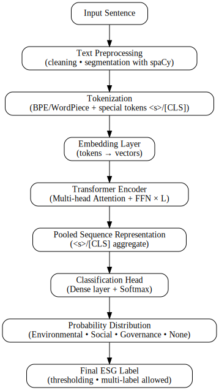
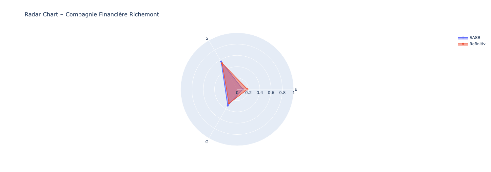
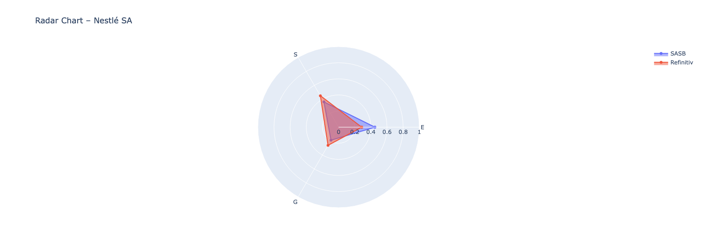
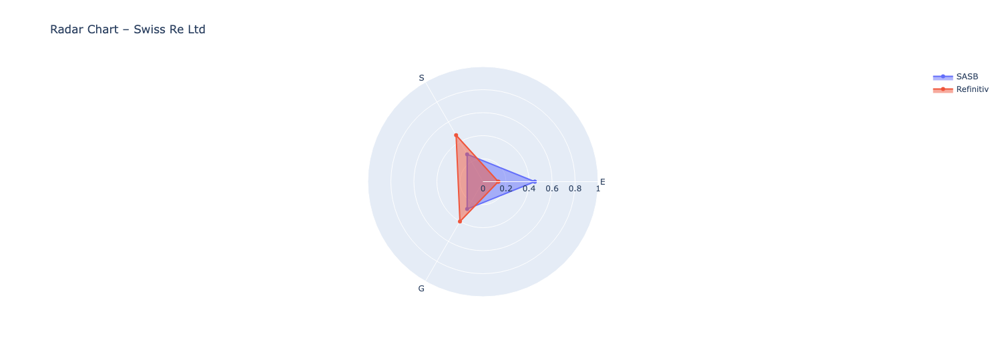
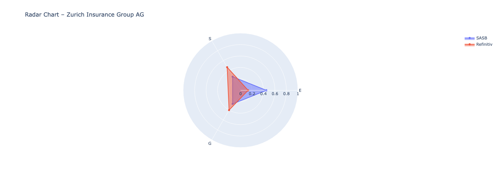
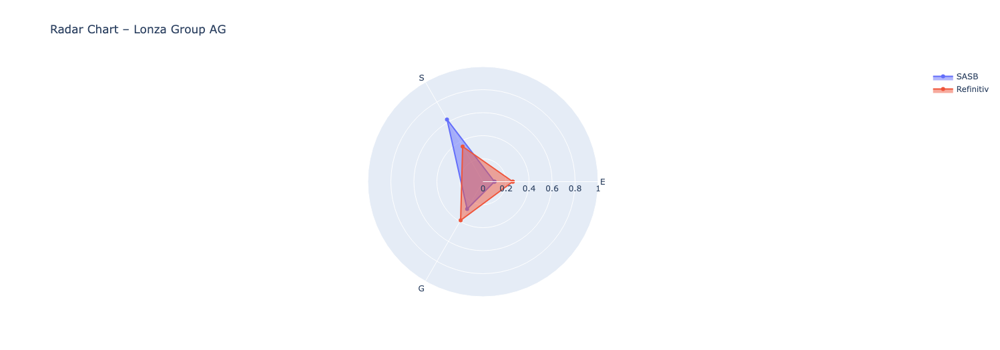
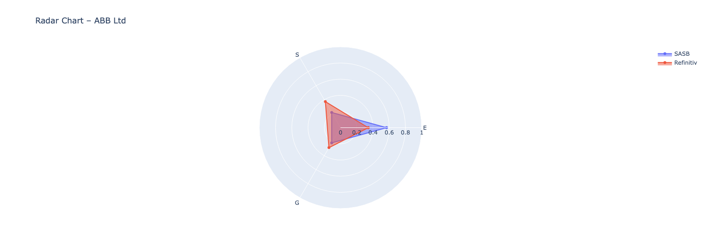
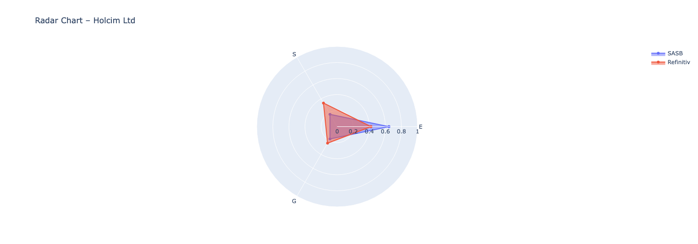
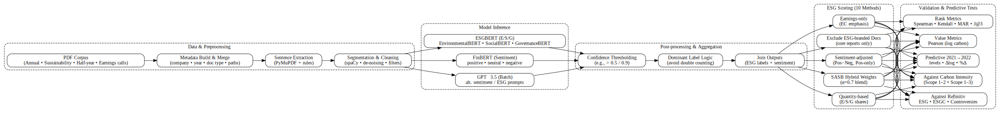

# Towards Transparent ESG Scoring: NLP-Based Signal Extraction from Swiss Corporate Disclosures

## Introduction

This project explores how **natural language processing (NLP)** and **transformer-based AI models** can be used to extract and analyze **Environmental, Social, and Governance (ESG)** signals from the official documents of Switzerland’s largest companies.

The motivation is threefold:  
1. **Scientific** — to test the validity and limitations of applying **natural language processing (NLP)** and **transformer-based AI models** to extract Environmental, Social, and Governance (ESG) signals from corporate texts.  
2. **Practical** — to explore whether open, replicable methods can provide a transparent alternative to proprietary ESG ratings, which are often opaque, inconsistent, and weakly correlated with real sustainability outcomes.  
3. **Critical** — to assess whether company self-disclosures can be trusted as evidence of sustainability performance, or whether they mostly reproduce **greenwashing dynamics** until stricter, audited reporting frameworks are in place.  

We focus on the **top 10 companies in the Swiss Market Index (SMI)**, over the **2021–2023** period, using a manually curated corpus of public disclosures: annual reports, ESG/sustainability reports, earnings calls, and more.

Through a series of notebooks, we:

- Build a structured and metadata-rich corpus from raw PDFs.
- Extract clean, self-contained sentences for NLP processing.
- Classify sentences using ESGBERT (ESG pillars), FinBERT (sentiment), and GPT-3.5 (alternative classifier).
- Benchmark results against human annotations to evaluate model performance.
- Design and compare 10 ESG scoring methods, with and without SASB materiality weights.
- Compare SASB-derived pillar weights with Refinitiv ESG weights to test alignment with market standards.
- Validate and stress-test the scores against external benchmarks (carbon intensity, Refinitiv ESG/ESGC, and Refinitiv controversies), including predictive checks (2021 → 2022).

## Data Disclaimer

⚠️ **Note**: Due to file size limitations and copyright considerations, the raw PDF documents (annual reports, earnings call transcripts, etc.) are not included in this repository. However, all files used in this project are publicly available online on the official investor relations websites of the selected companies, and full methodology is reproducible.  


## 📚 Table of Contents

- [Introduction](#introduction)
- [Data Disclaimer](#data-disclaimer)
- [Repository Structure](#repository-structure)
- [Notebook Pipeline](#-notebook-pipeline)
  - [Phase 0 : Data Collection](#phase-0--data-collection)
  - [Phase 1 : Dataset Construction](#phase-1--dataset-construction)
  - [Phase 2 : Dataset Exploration](#phase-2--dataset-exploration)
  - [Phase 3 : Sentence Extraction (NLP-ready)](#phase-3--sentence-extraction-nlp-ready)
  - [Phase 4 : ESG Sentence Classification Using Transformer Models](#phase-4--esg-sentence-classification-using-transformer-models)
  - [Phase 5 : ESG Classification Analysis](#phase-5--esg-classification-analysis)
  - [Phase 6 : Sentiment Analysis with FinBERT](#phase-6--sentiment-analysis-with-finbert)
  - [Phase 7 : GPT-3.5 Batch Sentiment Classification (as FinBERT Alternative)](#phase-7--gpt-35-batch-sentiment-classification-as-finbert-alternative)
  - [Phase 7.1 : Creating .jsonl batch files](#phase-71--creating-jsonl-batch-files)
  - [Phase 7.2 : Process output files returned by OpenAI](#phase-72--process-output-files-returned-by-openai)
  - [Phase 8 : Model Benchmarking on ESG and Sentiment Classification](#phase-8--model-benchmarking-on-esg-and-sentiment-classification)
  - [Phase 8.1 : Creating the Gold Standard Dataset](#phase-81--creating-the-gold-standard-dataset)
  - [Phase 8.2 : Model Evaluation and Comparison](#phase-82--model-evaluation-and-comparison)
  - [Phase 9 : ESG Scoring Methods and Comparison](#phase-9--esg-scoring-methods-and-comparison)
  - [Phase 10 : Comparing SASB Hybrid Weights with Refinitiv ESG Weights](#phase-10--comparing-sasb-hybrid-weights-with-refinitiv-esg-weights)
  - [Phase 11 : Validation and Predictive Testing of ESG Scores vs Carbon Intensity, Refinitiv Scores, and Controversies (2021–2022)](#phase-11--validation-and-predictive-testing-of-esg-scores-vs-carbon-intensity-refinitiv-scores-and-controversies-20212022)
- [General Conclusion](#-general-conclusion)

## Repository Structure

- `README.md`: Project overview, methodology, results, and conclusion.  
- `requirements.txt`: Python dependencies (transformers, spaCy, torch, etc.).  
- `Data/`: Directory not included in the repository.  
  - Raw PDFs and sentence datasets are stored on Google Drive.  
  - Output CSVs (e.g. `df_merged_clean.csv`, sentiment results, etc.) are generated during execution.
- `Notebooks/`: Directory containing Jupyter notebooks, ordered by project phase.
  - `1_Thesis.ipynb`: Metadata construction and file parsing.
  - `2_Thesis.ipynb`: Dataset exploration (pivot tables, gaps, visualizations).
  - `3_Thesis.ipynb`: Sentence extraction pipeline (PyMuPDF + spaCy).
  - `4_Thesis.ipynb`: ESG classification using ESGBERT models.
  - `5_Thesis.ipynb`: Analysis and visualizations of ESG classification results.
  - `6_Thesis.ipynb`: Sentiment classification using FinBERT.
  - `7_1_Thesis.ipynb`: Preparation of GPT-3.5 prompts in JSONL format.
  - `7_2_Thesis.ipynb`: Parsing and integration of GPT-3.5 batch results.
  - `8_1_Thesis.ipynb`: Construction of human-labeled dataset (gold standard).
  - `8_2_Thesis.ipynb`: Evaluation of FinBERT, GPT and ESGBERT against human labels.
  - `9_Thesis.ipynb`: ESG scoring logic and comparison of 10 scoring methods.
  - `10_Thesis.ipynb`: Comparison of SASB weights vs Refinitiv weights.
  - `11_Thesis.ipynb`: Validation & predictive tests (carbon intensity, Refinitiv ESG/ESGC, controversies).
- `Images/`: Directory containing graphs and visualizations generated in notebooks (confusion matrices, score comparisons, sentence distributions, etc.).

## Phase 0 : Data Collection

This project begins with the manual construction of a high-quality document corpus based on **publicly available corporate information** from companies listed in the **Swiss Market Index (SMI)**. To ensure data consistency and feasibility, we focus on the **top 10 SMI companies by market capitalization**, over the **2021–2023** period. These three years provide a sufficiently recent and rich dataset, with wide availability of sustainability and governance disclosures.

The sample also covers a **diverse set of industries**, included sectors are:  
- Electrical & Electronic Equipment  
- Processed Foods  
- Biotechnology & Pharmaceuticals  
- Apparel, Accessories & Footwear  
- Insurance  
- Asset Management & Custody Activities  
- Construction Materials  

### 🔍 Selected Sources of Information 

The dataset includes the following document types, which are commonly used in ESG assessments and financial analysis:

- **Annual Reports**  
- **Half-Year Reports**  
- **Sustainability Reports**  
- **Integrated Reports** (when available)  
- **Corporate Governance Reports**  
- **Earnings Call Transcripts & Fireside Chats**

The goal is to rely on **complete, public, and comparable documents** as the foundation for all subsequent analyses.

### ⚠️ Why the Collection Was Done Manually 

Although web scraping was initially considered, it quickly proved unreliable and inefficient due to the following issues:

- Each company has a unique website structure and navigation logic.
- Report titles and formats vary widely (e.g. *“Integrated Report”*, *“Creating Shared Value Report”*, *“Sustainability Highlights”*, etc.).
- Some websites load documents dynamically via JavaScript, making traditional scraping tools ineffective.
- Links to PDF files are often not directly accessible in the initial HTML.
- Document classification is inconsistent (e.g. a 2023 report might be listed under a 2024 tab).
- Multilingual content (e.g. Holcim: English titles, German content).
- Certain companies split reports across multiple categories (e.g. Swiss Re separates Business, Financial, and Sustainability reports).

✅ **Conclusion**: Manual collection ensured better reliability, completeness, and clarity.

### 🔊 Investor Communications and Earnings Call Transcripts

To complement the reports, I manually downloaded a diverse set of **transcripts from investor relations materials**, including **earnings calls**, **fireside chats**, and **Q&A sessions**. These materials are typically less polished and less controlled than formal sustainability or annual reports, making them particularly useful for more **objective ESG analysis**.

Unlike sustainability reports — which are often heavily curated for branding and compliance — investor communications respond directly to questions from analysts and stakeholders. This interactive nature makes them **less susceptible to greenwashing or corporate spin**, providing a more transparent view of a company’s priorities and risk management.

- Primary source: each company’s **Investor Relations** webpage (when available)
- Secondary source: **Seeking Alpha** (via a 28-day trial account) to supplement missing transcripts
- **Presentations were excluded**: they tend to be scripted and overly promotional
- Focus was placed on unscripted, **conversational formats** such as Q&A exchanges and analyst briefings

Due to **legal and technical limitations**, transcripts were collected manually. Automated scraping was not feasible: Seeking Alpha explicitly prohibits it in their [Terms of Use](https://seekingalpha.com/page/terms-of-use), and they implement active anti-scraping protections.

### 🗂️ File Organization & Metadata

All documents were stored in a structured folder on **Google Drive**.

To manage and track the collection process, I created two complementary metadata tables:

- **Sheet 1 – Presence Matrix**: overview of document availability by `Company × Year`, using Boolean indicators.
- **Sheet 2 – Document Register**: detailed information per file, including file name, type, and path.

The two sheets are linked by a unique `(Company, Year)` key.

### 📈 Coverage Summary

The table below summarizes the coverage status for the top 10 SMI companies (2021–2023). Most reports and transcripts were successfully collected. A few gaps remain, particularly for some quarterly earnings calls (e.g. Roche Q3 2021, Lonza Q3 2023).

| Company   | Reports Collected | Earnings Calls Collected |
|-----------|--------------------|---------------------------|
| Nestlé    | ✅                 | ✅                        |
| Novartis  | ✅                 | ✅                        |
| Roche     | ✅                 | ⚠️ Missing Q3 2021, Q1 2022 |
| Richemont | ✅                 | ⚠️ Missing Q1/Q3 all years |
| ABB       | ✅                 | ✅                        |
| Zurich    | ✅                 | ⚠️ Missing Q3 2021        |
| UBS       | ✅                 | ✅                        |
| Holcim    | ✅                 | ⚠️ Missing Q1/Q2/Q3 2021 and Q1 2022 |
| Swiss Re  | ✅                 | ✅                        |
| Lonza     | ✅                 | ⚠️ Missing Q1/Q3 for 2021, 2022, 2023 |


For the missing transcripts, I thoroughly searched across all available sources, including Investor Relations websites, Seeking Alpha, and other financial platforms. I also contacted someone with **Bloomberg Terminal access** (which has extensive coverage), but even there, the transcripts were unavailable. My working hypothesis is that **these earnings calls simply did not take place** — in **Switzerland**, unlike the **United States**, listed companies are **not legally required to hold four earnings calls per year**. Quarterly disclosures are common, but not mandatory or standardized.

➡️ *Source: SIX Swiss Exchange – [Periodic Reporting Requirements](https://www.ser-ag.com/en/topics/regular-reporting.html#:~:text=Compliance%20with%20the%20regular%20reporting,for%20issuers%20of%20other%20securities.)*

This manual collection phase lays the foundation for all subsequent analysis. The next step involves organizing these files into a structured dataframe with standardized metadata.

---

## Phase 1 : Dataset Construction

> 📁 **Note on data availability** : [Data Disclaimer](#data-disclaimer)
> 
> Due to file size limitations and copyright considerations, the raw PDF documents (annual reports, earnings call transcripts, etc.) are not included in this repository. However, all files used in this project are publicly available online on the official investor relations websites of the selected companies.  

In this first notebook, I construct the core dataset used for analysis by combining two sources:

- **Raw documents**: A manually collected set of PDF files (e.g. annual reports, sustainability reports, earnings call transcripts), stored on Google Drive.  
- **Metadata file**: An Excel spreadsheet with structured information about the top 10 SMI companies (e.g. company name, sector, report types, years).

### 🗂️ File Parsing and Metadata Extraction

I programmatically traverse each company's folder in Drive and extract metadata for every `.pdf` file:
- **Company** (from folder structure)
- **Year** (from file name or path)
- **Document Type** (inferred from filename keywords)
- **Document Title**
- **File Path**

A preview of the resulting dataset:

| Company                    | Year | Document Type     | Document Title                     | Path                                                                                      |
|----------------------------|------|-------------------|------------------------------------|-------------------------------------------------------------------------------------------|
| Zurich Insurance Group AG  | 2023 | Annual Report     | Zurich_Annual_Report_2023.pdf      | /content/drive/MyDrive/Thèse Master/Data/Zurich Insurance Group AG/Zurich_Annual_Report_2023.pdf |
| Zurich Insurance Group AG  | 2023 | Half-Year Report  | Zurich_Half_Year_Report_2023.pdf   | /content/drive/MyDrive/Thèse Master/Data/Zurich Insurance Group AG/Zurich_Half_Year_Report_2023.pdf |
| Zurich Insurance Group AG  | 2022 | Annual Report     | Zurich_Annual_Report_2022.pdf      | /content/drive/MyDrive/Thèse Master/Data/Zurich Insurance Group AG/Zurich_Annual_Report_2022.pdf |

This structured DataFrame is used to match each document with financial and ESG metadata (tickers, industry classification) in the next step.

### 📄 Complementary Metadata Table

Each document is also described in a second table that includes external metadata, such as tickers, industry classification, and download information.

| Company     | Year | Ticker SMI | Ticker Seeking Alpha (US) | Ranking per Cap | SASB Industry     | Document Type     | Document Title       | Source        | Source URL                                                        | Format | Scrapable via Google | Saved Local |
|-------------|------|-------------|----------------------------|------------------|--------------------|--------------------|------------------------|----------------|-------------------------------------------------------------------|--------|-----------------------|-------------|
| Nestlé SA   | 2023 | NESN        | NSRGY                     | 1                | Food & Beverage    | Annual Report      | Annual Review         | Nestlé Website | https://www.nestle.com/investors/publications                    | PDF    | No                    | Yes         |
| Nestlé SA   | 2023 | NESN        | NSRGY                     | 1                | Food & Beverage    | Half-Year Report   | Half-Year Report      | Nestlé Website | https://www.nestle.com/investors/publications                    | PDF    | No                    | Yes         |


### 🔗 Metadata Merge

The extracted document data is then merged with the Excel file, matching each `(Company, Year)` pair.  
The Excel metadata includes:
- Company tickers (SMI and Seeking Alpha)
- SASB industry classification

Before merging, I performed several standardization steps to ensure consistency and avoid mismatches:
- Standardized company names (e.g. `Nestle` vs `Nestlé`)
- Converted year values to strings
- Normalized accents (e.g. `é` → `e`)

After merging, I removed perfect duplicates based on core metadata fields to ensure a clean dataset.

📄 **Output file**: `df_merged_clean.csv`  
This file is saved in Drive and serves as the input for the next phase of the project.

> 💡 The full source code for this metadata cleaning and merge process is available in the notebook:  
> [`1_Thesis.ipynb`](./Notebooks/1_Thesis.ipynb)

---

## Phase 2 : Dataset Exploration

In this phase, I perform an exploratory analysis of the merged dataset created in [Phase 1](#phase-1--dataset-construction). The goal is to verify data completeness, detect missing entries, and understand the distribution of document types.

### 🧮 Key Analyses

- **Total number of documents** per company and year  
- **Distribution of document types** (e.g. Annual Report, Sustainability Report, etc.)  
- **Pivot table** to visualize which types are available for each company-year combination  
- **Gap detection** to identify missing reports or transcripts  

A sample of the pivot table below shows how many documents of each type were collected for ABB Ltd between 2021 and 2023:

| Company | Year | Annual Report | Earnings Call Transcript | Governance Report | Half-Year Report | Integrated Report | Sustainability Report |
|---------|------|----------------|----------------------------|--------------------|-------------------|--------------------|------------------------|
| ABB Ltd | 2021 | 1              | 4                          | 0                  | 0                 | 0                  | 1                      |
| ABB Ltd | 2022 | 0              | 4                          | 1                  | 0                 | 1                  | 1                      |
| ABB Ltd | 2023 | 0              | 4                          | 1                  | 0                 | 1                  | 1                      |

This overview ensures the corpus is both **comprehensive and well-documented** before proceeding to the text extraction phase.

> 💡 For details and full visualizations, see the notebook:
> 
>  [`2_Thesis.ipynb`](Notebooks/2_Thesis.ipynb).

---

## Phase 3 : Sentence Extraction (NLP-ready)

This step is the most **crucial foundation** for the NLP classification phase. It involves extracting clean, meaningful, and self-contained sentences more than 200 corporate documents (Annual Reports, ESG Reports, etc.).

To achieve this, I built a sentence extraction pipeline using:

- [**PyMuPDF**](https://pymupdf.readthedocs.io/en/latest/): a fast and lightweight PDF parser that allows page-by-page access and precise text extraction from complex layouts.
- [**spaCy**](https://spacy.io/): a powerful industrial-strength NLP library that handles sentence segmentation, tokenization, and linguistic filtering.

Each document is parsed **page by page**, applying a series of custom cleaning operations:

- **Removal of repeated headers and footers** (e.g. company name, year, page numbers)
- **Exclusion of index pages** (detected using pattern frequency heuristics)
- **Sentence segmentation** with spaCy
- **Filtering out** short, noisy, numeric-only, or symbol-heavy text chunks

The resulting sentences were then saved to CSV for further processing.

Due to the complexity of the documents and the amount of layout noise, **this step took significant runtime** and had to be repeated **entirely from scratch**. Initially, I proceeded with the pipeline, assuming the extraction quality was sufficient. However, at the NLP classification stage, I noticed that the results were poor — many "sentences" were in fact titles, footers, page numbers, or table of contents entries that had been incorrectly parsed as meaningful content.

This significantly degraded model performance and introduced semantic noise. As a result, I had to go back to this sentence extraction phase, rebuild the cleaning logic, and reprocess **all documents again**, which took time but drastically improved the output quality. This experience highlighted how **crucial and foundational** this stage is for the success of the entire NLP pipeline: if sentence quality is poor, no downstream analysis can be trusted.

> 💡 For full implementation details, see the notebook:
> 
> [`3_Thesis.ipynb`](Notebooks/3_Thesis.ipynb)

---

## Phase 4 : ESG Sentence Classification Using Transformer Models

This notebook performs sentence-level classification across all extracted company reports to assign ESG labels — **Environmental**, **Social**, **Governance**, or **None** — to each sentence.

We follow the methodology from [Tobias Schimanski's tutorial on Medium](https://medium.com/@schimanski.tobi/analyzing-esg-with-ai-and-nlp-tutorial-1-report-analysis-towards-esg-risks-and-opportunities-8daa2695f6c5), which is based on his academic paper:

> *“Bridging the gap in ESG measurement: Using NLP to quantify environmental, social, and governance communication”*  
> *Tobias Schimanski et al., 2023*

We use the **ESGBERT transformer models**, available from HuggingFace ([ESGBERT models repository](https://huggingface.co/ESGBERT)), which are fine-tuned BERT-based classifiers trained specifically to detect ESG content. Three separate models are loaded:
- `EnvironmentalBERT` for environmental content,
- `SocialBERT` for social-related content,
- `GovernanceBERT` for governance themes.

Each sentence is passed through all three models, which are binary classifier for a signel pillar (E, S, or G). Each model returns:
- a **label** (either the target class or `"none"`),
- a sigmoid probability in `[0,1]` independently of the other pillars (this is multi-label scoring, not a softmax that sums to 1 across classes).

**Example result:**

| company                   | year | document_type       | sentence                                                                                                                                                       | label_env   | score_env | label_soc | score_soc | label_gov | score_gov |
|---------------------------|------|----------------------|----------------------------------------------------------------------------------------------------------------------------------------------------------------|-------------|-----------|-----------|-----------|-----------|-----------|
| ABB Ltd | 2023 | Integrated Report | As a  business that means reducing our own green­ house gas emissions and adopting circular  business practices. | environmental | 0.99818  | none    | 0,99985  | none      | 0,99360  |


We treat the three pillar models independently (multi-label). For downstream aggregation, we then derive a single **dominant label** per sentence as follows:
- keep all pillars with score > 0.50 (detection threshold);
- if none exceed 0.50 → label = none;
- if one or more exceed 0.50 → label = the pillar with the highest score (argmax);

This approach ensures that **each sentence is independently evaluated** for its ESG relevance, allowing nuanced and overlapping classifications.

### 🧱 Batching for Large-Scale Classification

With **over 200,000 sentences** to classify, we split the dataset into **batches of 10,000** sentences for processing. This prevents memory overflow and allows intermediate saving of results. The batch loop:
1. Loads a slice of the data.
2. Applies the three ESG classifiers.
3. Saves the result to a dedicated folder in Google Drive.

After all batches are processed, they are concatenated into a single file and a final label column is assigned based on dominant confidence scores.

### ⚙️ Running on GPU to Save Time (and Money)

Running transformer models is computationally intensive. Fortunately, Google Colab occasionally offers **free GPU access** (NVIDIA T4, 16 GB VRAM). I was able to access a GPU for this classification step, which brought the total runtime down to just over **1 hour**.

Without GPU, this task would likely take several **hours or even days**, depending on hardware. However, after using the GPU for one full classification session, it became unavailable for the rest of the day — highlighting the **budgetary and infrastructural constraints** of this kind of academic project.

**Overview - ESG classification pipeline:**  




> 💡 The entire classification pipeline - loading models, batching, applying prediction, and saving results — is detailed in :
> [`4_Thesis.ipynb`](Notebooks/4_Thesis.ipynb)

---

## Phase 5 : ESG Classification Analysis

This  step analyzes the ESG sentence-level classifications obtained from the previous stage. The goal is to produce insightful descriptive statistics and visualizations by company, year, and document type.

### 🗂️ Dataset Structure

Each row in the dataset corresponds to a sentence extracted from a document (report or earnings call), along with its ESG classification labels and associated confidence scores (between 0 and 1) for Environmental, Social, and Governance pillars.

Key columns include:
- `company`, `year`, `doc_type`
- `sentence`: raw sentence text
- `label_env`, `score_env`
- `label_soc`, `score_soc`
- `label_gov`, `score_gov`
- `label_dominant`

### 🧮 Global Classification Breakdown

Each sentence is assigned to a **classification type** based on whether one or more pillars have a confidence score > 0.9. The breakdown is as follows:
- `E`, `S`, or `G`: when exactly one pillar is confidently dominant
- `multi (2)` or `multi (3)`: when two or all three labels are simultaneously strong
- `none`: when the classification is "none", or when no score exceeds the 0.9 threshold

> *Threshold policy*. We use two thresholds for different purposes:
> 
> • 0.50 (detection): minimal confidence to count a sentence as ESG for label assignment (dominant label) and for most analyses.
> 
> • 0.90 (high-precision subset): a stricter filter used in selected charts to highlight high-confidence ESG mentions. This favors precision over recall (conservative view of ESG coverage).

📊 **Distribution of classification types** (with score > 0.9):


> 🔍 Most sentences are classified as `none`, so not ESG related. Among valid ESG sentences, Environmental classifications appear most frequently, followed by Social and Governance. Multi-label sentences are present.


### 📄 Sentence Volume by Document Type

The dataset contains sentences from various types of documents (Annual Reports, ESG Reports, Earnings Calls...).

📊 **Total number of sentences per document type**:


> 🧾 **Annual Reports** clearly dominate in terms of extracted sentence volume, followed by **Earnings Call Transcripts**. This reflects the length and density of these documents. **Sustainability Reports** are significantly shorter in comparison. Governance-specific and Half-Year reports contribute marginally to the overall corpus.
>
> However, this distribution is **not uniform across companies**. Some firms, such as Nestlé or UBS, publish multiple earnings call transcripts per year—sometimes including additional materials like fireside chats or analyst sessions—while others provide fewer or none. This heterogeneity impacts the total number of sentences extracted per document type and should be considered when comparing across firms.

### 🏢 Sentence Counts by Company

📊 **Total number of extracted sentences by company (including non-ESG)**:


> This chart displays the total number of extracted and processed sentences per company, regardless of ESG classification. It includes all sentences, even those not assigned to any ESG category (i.e. labelled as "none").
>
> UBS, Nestlé, and Swiss Re show the highest overall sentence counts. These differences may reflect disparities in the number, length, and structure of reports published by each firm. For example, some companies release multiple types of documents (annual, sustainability, earnings calls) per year, while others offer fewer disclosures or shorter materials.


### 📈 ESG Sentence Share

This chart presents the **proportion of ESG-classified sentences (score > 0.9)** over the **total number of sentences** for each company. It helps compare the relative prominence of ESG content in corporate disclosures, regardless of total document volume.

📊 **Proportion of ESG sentences per company**:

.png)

> 🧮 This metric controls for differences in report length or number of documents. Holcim and ABB stand out with the highest shares of high-confidence ESG content, suggesting a relatively strong ESG signal density across their documents.
>
> 🧪 Conversely, Novartis and Roche have large corpora but a smaller relative share of ESG-classified sentences. This could reflect either less ESG-oriented language or greater content volume outside ESG topics (e.g., scientific or operational reporting).
>
> ⚠️ Important: this figure captures **the presence of ESG-related communication**, not its sentiment or tone. A company may discuss ESG issues in a critical, defensive, or neutral way — high proportions do not necessarily mean strong ESG performance or commitment.
>
> 🔍 Lastly, the use of a 0.9 threshold ensures high precision in classification, but may exclude more nuanced or indirect ESG references that fall below this confidence level.

###  Dominant Label Overview (No Threshold)

Each sentence may receive multiple ESG labels (e.g., both Social and Governance) if it meets high confidence scores in more than one category. This makes sense conceptually, as some statements touch on cross-cutting themes — such as workplace ethics or climate governance — but it poses challenges when we later want to calculate pillar-specific ESG scores.

To avoid **double-counting** sentences in multiple pillars, we introduce a dominant label: the ESG class with the **highest individual confidence score** per sentence. This allows for clean aggregation and comparison across companies.

📊 **Dominant ESG label distribution by company** :

In this chart, each sentence is assigned a **dominant label** — the ESG category (Environmental, Social, or Governance) with the **highest classification score** (or not ESG), regardless of whether the score exceeds a threshold. This allows us to analyze how ESG topics are distributed across companies when we force a single label per sentence.

.png)

>
> 📌 The results vary significantly across companies:
> - **Holcim** and **Swiss Re** display a strong emphasis on Environmental topics.
> - **Nestlé**, **Richemont**, and **Roche** place greater focus on Social issues.
> - The remaining companies present a more balanced distribution across ESG pillars, although Governance consistently appears slightly less prominent.

> 🔍 Notably, many sentences still fall under the 'none' category (i.e., no ESG score exceeded any pillar-specific model), but this doesn’t mean the sentence was irrelevant — it simply wasn’t confidently ESG-tagged by the classifier.


###  📈 ESG Sentence Share

📊 **ESG label proportions by company:**

.png)

This chart shows the proportion of ESG-classified sentences over the total, but **based exclusively on each sentence's *dominant* label** — in other words, each sentence is counted **once**, according to its strongest ESG dimension (Environmental, Social, or Governance).

#### 🧭 Key Takeaways:
- **Holcim**, **ABB**, and **Swiss Re** remain the companies with the highest ESG communication ratios.
- However, several **ranking shifts** appear compared to the previous chart, which accounted for **multi-label classification** (where one sentence could contribute to multiple ESG categories):
  - **UBS Group AG** drops from **4th to 7th**,  
  - **Nestlé SA** falls from **5th to 8th**,  
  - **Lonza Group AG** rises from **7th to 5th**.

These changes highlight an important methodological point:  
➡️ **Using multi-label classification inflates ESG coverage** by counting the same sentence multiple times — once per label.  
➡️ In contrast, assigning only the dominant ESG label ensures **non-redundant, clearer attribution**, offering a more conservative and arguably more accurate estimate of ESG focus.

This distinction is crucial for fair comparisons across companies and for avoiding overestimation of ESG communication intensity.

### 📌 Conclusion

This section provided a comparative overview of ESG communication across major Swiss companies, based on the number and proportion of ESG-classified sentences. By switching from a multi-label view to a dominant-label approach, we observed meaningful changes in company rankings — underlining the importance of methodological consistency when interpreting ESG discourse.

> 💡 For further analyses, full code, and dynamic breakdowns, please refer to the notebook:
> [`5_Thesis.ipynb`](Notebooks/5_Thesis.ipynb).

---

## Phase 6 – Sentiment Analysis with FinBERT

In this phase, we enrich our ESG-classified sentences by applying **FinBERT**, a transformer-based model fine-tuned for financial sentiment analysis. This helps us not only classify the nature of ESG content (Environmental, Social, Governance), but also understand **how** companies talk about these topics — whether in a **positive**, **negative**, or **neutral** tone.

🔍 **What is FinBERT?**  
FinBERT is a domain-specific adaptation of [BERT](https://arxiv.org/abs/1810.04805), pre-trained on financial texts to detect sentiment more accurately in that context. It was developed by researchers at HKUST and is available via Hugging Face:  
👉 [yiyanghkust/finbert-tone](https://huggingface.co/yiyanghkust/finbert-tone)

💡 **Why do we use it here?**  
Traditional sentiment models may misinterpret financial or corporate jargon. FinBERT improves precision in our context (company reports, ESG disclosures) and allows us to measure **the tone of ESG-related discourse** for each firm. This can later be aggregated to derive **sentiment-based ESG scores**.

#### 📌 Overview of this notebook:

1. **Mount Google Drive & Load ESG Sentences**  
   We load the CSV from a previous step that contains all extracted sentences, and filter for those classified as ESG (either environmental, social, or governance).

2. **Load FinBERT with GPU Acceleration**  
   We use the Transformers library to load the FinBERT model and tokenizer. If a GPU is available in the Google Colab environment, inference becomes significantly faster.

3. **Run Sentiment Classification**  
   Each ESG sentence is passed through FinBERT to generate a sentiment score across three labels: `positive`, `negative`, and `neutral`. The label with the highest probability is selected as the predicted sentiment (`sent_label`).

4. **Export the Results**  
   The dataset, now enriched with sentiment scores, is saved for further steps.


📦 **Output**  
The resulting file contains the original ESG sentences along with:
- `sent_pos`: probability of a positive sentiment  
- `sent_neg`: probability of a negative sentiment  
- `sent_neu`: probability of a neutral sentiment  
- `sent_label`: final sentiment label based on the highest score

This output is ready for downstream analysis.

 **Limitations & domain fit :**
FinBERT is purpose-built for **financial** sentiment—pretrained on financial communication (10-K/10-Q, earnings-call transcripts, analyst reports) and commonly fine-tuned on the Financial PhraseBank. ESG discourse uses policy/regulatory/sustainability language that only partly overlaps. In this project we therefore treat FinBERT as a finance-sentiment baseline, not an ESG-specialized classifier, and benchmark it against GPT-3.5 on the same sentences.[^finbert-tone][^prosusai][^araci]

**Examples of domain mismatch (see Phase 8_2 for more):**  
- *“Compared with 2018, operational emissions have decreased by 69% in absolute terms.”* → FinBERT classified this as **negative**, likely because a decline in percentage terms is usually bad news in financial contexts (profits, revenues), whereas here it signals a positive ESG outcome (lower emissions).  
- *“Protecting smallholder farmers in Mexico. In Mexico, over 80% of total economic losses from weather-related disasters in the last two decades occurred in the agricultural sector.”* → FinBERT failed to capture the **positive sustainability framing** (protecting vulnerable farmers) and instead focused on the mention of “losses,” skewing the classification toward the negative.  

[^finbert-tone]: Hugging Face — *yiyanghkust/finbert-tone*: https://huggingface.co/yiyanghkust/finbert-tone
[^prosusai]: Hugging Face — *ProsusAI/finbert* (fine-tuned on Financial PhraseBank): https://huggingface.co/ProsusAI/finbert
[^araci]: Araci, D. (2019). *FinBERT: Financial Sentiment Analysis with Pre-trained Language Models*. https://arxiv.org/abs/1908.10063


> 💡The code is available in :
> [`6_Thesis.ipynb`](Notebooks/6_Thesis.ipynb)
---

## Phase 7 – GPT-3.5 Batch Sentiment Classification (as FinBERT Alternative)

In this step, we test **GPT-3.5** as an alternative to the **FinBERT classifier** used previously. The goal is to evaluate whether GPT-3.5 can produce comparable or better sentiment predictions on ESG-related sentences, while maintaining a **good cost-performance balance**.

### 💡 Why GPT-3.5 and not GPT-4?

We chose **GPT-3.5** because:

- It offers a **significantly lower cost** than GPT-4 (*prices as of August 2025, see vendor pricing page for current rates*):
  - GPT-3.5-turbo-0125: ~$0.50 per 1,000 requests (1-token outputs)
  - GPT-4-turbo: ~$10–15 per 1,000 requests (depending on context size)
- For a **simple classification task** like ours—predicting `positive`, `neutral`, or `negative`—GPT-4 would be overkill.
- GPT-3.5 has proven to be **accurate enough**, and is therefore the best choice in terms of **price/performance ratio**, especially in an academic project context where budget matters.

### 📦 What are OpenAI Batches?

Rather than sending thousands of API calls one-by-one from Google Colab (which would be **extremely slow and unstable**), we used **OpenAI’s Batch API**:

- You upload a `.jsonl` file with thousands of requests.
- OpenAI processes them asynchronously in the cloud.
- You receive a single `.jsonl` file with all the results.

In my benchmarks, batch processing proved to be dramatically faster (close to two orders of magnitude) compared to client-side loops, while also being more stable for large workloads. However, it also has limitations :

- **Only one batch job can run at a time**.
- Each batch can take **up to 24 hours** to complete.
- There is a **maximum file size per batch**, so we had to split our dataset into **4 separate batch files**.

### ✍️ What is a Prompt, and Why Does It Matter?

A **prompt** defines how GPT interprets a task. In our case, we crafted a `system` prompt that tells the model exactly **what kind of response we expect**:

```text
You are an assistant that performs sentiment classification for ESG-related sentences.
For each input, respond only with one of the following labels: 'positive', 'neutral', or 'negative'.
Use 'positive' if the sentence describes an improvement, benefit, or progress.
Use 'negative' if it describes controversies, problems, or deteriorations.
Use 'neutral' if it is descriptive without clear judgment or consequence.
```

This prompt is included once per request, and its **clarity directly impacts the consistency and accuracy** of the model’s response.  
A vague or overly complex prompt can lead to irrelevant or inconsistent labels. That’s why **prompt engineering is a critical part of using LLMs for classification.**

> ⚠️ **Model Variability:**
> A strict prompt and `temperature=0` setting were used to maximize reproducibility. However, unlike static classifiers such as FinBERT or ESGBERT, GPT models remain **non-deterministic systems**: even under identical conditions, they can occasionally return slightly different outputs or formatting. This variability is infrequent but relevant, as it highlights a key academic limitation of LLM-based classification — results cannot be assumed perfectly stable or replicable without additional post-processing controls.

### 📁 What is JSONL Format?

The `.jsonl` format (JSON Lines) is a plain text file where each line is a valid JSON object. For OpenAI’s batch endpoint, each line defines a **single request** with:

- a `custom_id` to track results,  
- the `messages` field with both system and user content,  
- model parameters like `max_tokens`, `temperature`, etc.

This format is **lightweight**, line-by-line **parseable**, and highly efficient for batch processing.

---

## Phase 7.1 : Creating .jsonl batch files

- Load ESG sentences from the DataFrame.  
- Create 4 `.jsonl` batch files using a fixed system prompt.  
- Save files to disk for upload to OpenAI’s Batch API.  

> 💡 See full code in:
>  [`7_1_Thesis.ipynb`](Notebooks/7_1_Thesis.ipynb)

---

## Phase 7.2 : Process output files returned by OpenAI

- Parse the 4 `.jsonl` output files returned by OpenAI.  
- Map each sentiment label (`positive`, `neutral`, `negative`) back to the original DataFrame using the `custom_id`.  
- Save the updated dataset for comparison with FinBERT results.  

#### 📊 Example Output Table

| company | year | document_type     | sentence                                                                                                                                      | label_env   | score_env | label_soc | score_soc | label_gov | score_gov | label_dominant | sentiment_gpt_batch |
|---------|------|-------------------|-----------------------------------------------------------------------------------------------------------------------------------------------|-------------|-----------|------------|-----------|------------|-----------|----------------|----------------------|
| ABB Ltd | 2023 | Integrated Report | ABB’s purpose is to enable a more sustainable and resource-efficient ­future with our technology leadership in electrification and automation. | environmental | 0.9976    | none       | 0.9999    | none       | 0.9924    | environmental     | positive             |

> 💡 See full code in :
>  [`7_2_Thesis.ipynb`](Notebooks/7_2_Thesis.ipynb)

---

## Phase 8 : Model Benchmarking on ESG and Sentiment Classification

This section evaluates the **performance of multiple classification models** on a carefully curated, human-annotated dataset of 188 ESG-related sentences.
> ***Annotation protocol:***
>
> All labels in the gold-standard set were annotated by me using the same operational definitions as the GPT-3.5 prompt presented below. While I would ideally rely on multiple annotators and report inter-annotator agreement (e.g., Cohen’s κ), this was not feasible within the scope of this project due to time and resource constraints. I acknowledge that some judgements are inherently subjective and that even my own second-pass readings occasionally differed; the dataset should therefore be viewed as a careful but single-annotator benchmark.

The goal is to compare both **ESG pillar classification** and **sentiment analysis** across three major approaches:

- A fine-tuned **ESG-BERT model** (`label_dominant`)
- A finance-specific **FinBERT sentiment model** (`sentiment_finbert`)
- A prompt-based **GPT-3.5 sentiment and ESG classifier** (`sentiment_gpt_batch`, `esg_gpt3`)

**ESG Classifier prompt :**

```text
Classify the following sentence into one ESG category: environmental, social, governance, or none.
Respond with only one word: "environmental", "social", "governance", or "none".
```

In classification tasks, a more explicit prompt usually improves consistency (fewer ambiguous outputs). However, the API is billed per token, so longer prompts cost more—especially at large scale. To keep costs under control, I use a compact, strict-output prompt and fix temperature=0 for stability.

When budget allows, an extended prompt  can be used for a small accuracy boost at the expense of a higher input-token footprint.

---

## Phase 8.1 – Creating the Gold Standard Dataset

We create a **balanced evaluation dataset** of 188 rows, called `gold standard`, used to benchmark the models. It includes:

- 50 sentences for each sentiment class: **positive**, **neutral**, and **negative**
- At least 50 samples from each ESG pillar: **Environmental**, **Social**, and **Governance**
- Representation of all document types and companies in the corpus

Additional columns (`sentiment_humain` and `esg_label_humain`) were added for **manual annotation** by a human reviewer, serving as the **ground truth**.

We chose to create a balanced dataset to ensure fair evaluation across both tasks (sentiment and ESG classification) and to avoid any bias introduced by skewed class distributions, which are common in real-world ESG texts. This setup also helps to better interpret the strengths and weaknesses of each model.

Due to time and resource constraints — in particular, the manual effort required to annotate each sentence accurately — we limited the dataset to 188 sentences. Annotating significantly more would not have been feasible for a single person in a short timeframe, and this sample still ensures good representativeness of the corpus.

> 💡See full code in :
>  [`8_1_Thesis.ipynb`](Notebooks/8_1_Thesis.ipynb)

---

## Phase 8.2 : Model Evaluation and Comparison

We evaluate the predictions from the three models against the **human-labeled gold standard**, using accuracy, F1-scores, and confusion matrices.

#### ✅ Evaluated Models

| Task                | Model           | Col. in DataFrame          |
|---------------------|------------------|-----------------------------|
| ESG classification  | ESGBERT         | `label_dominant`           |
| Sentiment analysis  | FinBERT          | `sentiment_finbert`        |
| Sentiment analysis  | GPT-3.5          | `sentiment_gpt_batch`      |
| ESG classification  | GPT-3.5 (prompt) | `esg_gpt3`                 |
| Human benchmark     | Ground truth     | `sentiment_humain`, `esg_label_humain` |


### 📈 Key Results Summary

| Evaluation                          | Accuracy | Macro F1 | Weighted F1 |
|-------------------------------------|----------|----------|--------------|
| **ESGBERT vs Human (with 'none')**  | 0.86     | 0.63     | 0.85         |
| **ESGBERT vs Human (no 'none')**    | 0.88     | 0.86     | 0.88         |
| **GPT-3.5 vs Human (ESG)**          | 0.73     | 0.59     | 0.79         |
| **FinBERT vs Human**                | 0.60     | 0.54     | 0.59         |
| **GPT-3.5 vs Human (Sentiment)**    | 0.72     | 0.68     | 0.74         |
| **GPT-3.5 vs ESG-BERT**             | 0.71     | 0.56     | 0.76         |

📌 The **GPT-3.5 model outperforms FinBERT** on sentiment, especially for the **positive** and **negative** classes.  
📌 ESG-BERT remains the most reliable for ESG classification, but GPT-3.5 shows strong potential via prompt-based classification.

### 📉 Confusion Matrix Visualizations

All confusion matrix plots are available in the `Images` folder:

- [Comparison Accuracy](Images/Comparison_Accuracy.png)
- [Comparison Macro F1](Images/Comparison_Macro%20F1.png)
- [Comparison Weighted F1](Images/Comparison_Weighted%20F1.png)
- [Confusion – ESG GPT vs ESGBERT](Images/Confusion_ESG%20GPT%20vs%20ESGBERT.png)
- [Confusion – ESG GPT vs Human](Images/Confusion_ESG%20GPT%20vs%20Human.png)
- [Confusion – ESGBERT vs Human (without none)](Images/Confusion_ESGBERT%20vs%20Human%20(without%20none).png)
- [Confusion – ESGBERT vs Human](Images/Confusion_ESGBERT%20vs%20Human.png)
- [Confusion – Sentiment FinBERT vs Human](Images/Confusion_Sentiment%20-%20FinBert%20vs%20Human.png)
- [Confusion – Sentiment GPT vs Human](Images/Confusion_Sentiment%20-%20GPT%20vs%20Human.png)


**Example – Confusion Matrix: GPT-3.5 Sentiment vs Human  :**


**Comparison of the evaluations :**


### 🔍 Interpretation and Error Analysis

For each test, we printed misclassified examples to better understand where models fail:

- **ESGBERT** struggles particularly with the "social" and "governance" classes. It often confuses governance with social, but when it predicts governance, it's usually correct — it tends to miss governance rather than misclassify it.
- **FinBERT** often mislabels neutral statements as positive or negative, which can be problematic when aggregating scores at scale or deriving sentiment indicators.
- **GPT-3.5** has difficulties with negative sentiment, especially when the sentence is a factual statement about climate change or environmental risks — it tends to classify such statements as negative, even when they are not evaluative or directed at the company.
- **GPT-3.5** for ESG classification performs decently, but tends to assign "governance" labels to sentences that are actually social, or mark them as "none".

### 💡 Takeaways

- **ESGBERT** is the most reliable model for ESG pillar classification.

- **GPT-3.5** outperforms **FinBERT** in sentiment analysis, particularly on the positive and neutral classes. Despite some confusion on factual negative statements, it remains the most robust sentiment model in this benchmark.

- As a result, ESGBERT (for ESG classification) and GPT-3.5 (for sentiment analysis) will be used to compute ESG sentiment scores in the next phase of the thesis.

- Manual annotation remains essential to assess model quality and build a trustworthy benchmark, especially when evaluating real-world performance.

- Prompt engineering with GPT-3.5 offers a flexible, low-cost alternative for quick prototyping, though results depend on prompt clarity and task design.

> 💡 See full code in :
> [`8_2_Thesis.ipynb`](Notebooks/8_2_Thesis.ipynb)

---

## Phase 9 : ESG Scoring Methods and Comparison

This notebook computes and compares **ten distinct ESG scores** for each company in the SMI index, based on the classification of sentences extracted from their annual reports, earnings calls, and other key financial documents. The aim is to explore how various analytical methods—both qualitative and quantitative—affect ESG scoring outcomes and comparability.

### 🧠 Why Compare So Many ESG Scores?

Each method reflects a different underlying assumption about how ESG priorities manifest in corporate communication:

- **Is ESG communication abundant or sparse?**  
  → *How much does the company talk about ESG in its communications?*  
  (Assuming that frequent mentions signal strategic prioritization.)

- **Are earnings calls more reflective of priorities than general reporting?**  
  → *Do earnings calls—being less curated and more spontaneous—provide a clearer, less "greenwashed" view of ESG concerns compared to polished sustainability reports?*

- **Do non-ESG-branded documents offer more honest signals?**  
  → *Do general-purpose documents like financial reports better reflect real ESG priorities than those crafted for marketing or ESG compliance?*

- **Should all ESG pillars be treated equally, or weighted by relevance (materiality)?**  
  → *Is it realistic to treat Environment, Social, and Governance as equally important? Or should we account for their sector-specific importance using SASB’s materiality framework?*

- **Should we account for tone (positive vs. negative) or just presence?**  
  → *Is it enough to track ESG mentions, or should we distinguish between positive and negative statements?*  
  *(Even advanced LLMs like GPT-3.5 struggled with negative sentences. In that context, focusing on **positive-only** mentions may yield more robust results.)*

This comparative approach helps test the **robustness**, **biases**, and **underlying assumptions** behind different ESG scoring frameworks.

### ESG Scoring Methods Explained

Each score is computed per company and year. Here's an overview of the ten methods:

| ID   | Description |
|------|-------------|
| **1**  | ESG Quantity — share of E/S/G sentences among all sentences. Equal weight. |
| **2**  | ESG Quantity weighted by SASB — E/S/G weighted using industry materiality weights. |
| **3**  | ESG in Earnings Calls — same as (1) but only for earnings call content. |
| **4**  | Earnings Calls + SASB — same as (2) but restricted to earnings calls. |
| **5**  | ESG in Core Documents — filtered to reports (annual, half-year, integrated). |
| **6**  | Core Docs + SASB — same as (5) with materiality weighting. |
| **7**  | Positive - Negative ESG — sentiment-adjusted ESG: (Pos − Neg) / Total ESG. |
| **8**  | Pos − Neg + SASB — sentiment-adjusted ESG with SASB weights. |
| **9**  | Positive Only — share of positive ESG sentences (no negation). |
| **10** | Positive Only + SASB — same as (9) with SASB weights. |


### 🧮 SASB Hybrid Weights Methodology

To refine the ESG scoring and account for sector-specific relevance of each pillar (Environment, Social, Governance), we created **custom hybrid weights** for each company using the SASB Materiality Map.

**⚙️ How Hybrid Weights Were Calculated**

We manually identified the *relevant material issues* for each company based on their SASB industry classification, and assigned them to one of the ESG pillars (E, S, or G).

Then, for each company:

- We **counted** the number of relevant topics per pillar.
- We **normalized** those counts by the total number of relevant topics, obtaining relative weights:

$$
w_E^{(0)} = \frac{n_E}{n_{E+S+G}}, \quad
w_S^{(0)} = \frac{n_S}{n_{E+S+G}}, \quad
w_G^{(0)} = \frac{n_G}{n_{E+S+G}}
$$

However, in some cases, one pillar could receive a zero weight (e.g., no relevant issues marked as "Governance"). To **avoid discarding** entire pillars while still reflecting sector-specific priorities, we introduced a **hybrid weighting scheme** using a fixed blending factor:

**⚖️ Hybrid Formula with α = 0.7**

We set:

- **α = 0.7** as the relative weight given to the SASB-derived proportions (materiality-based)
- **1 − α = 0.3** to ensure a baseline equal weighting across pillars

> Why α = 0.7 ? We chose α = 0.7 to prioritize materiality (70% SASB-derived) while guaranteeing a floor of 10% per pillar via the equal-weight blend 
(1−α)/3=0.10. This avoids zeroing any pillar for niche sectors yet keeps more than half of the weight driven by SASB relevance.

Thus, for each company, the final weights are calculated as:

$$
w_E = \alpha \cdot w_E^{(0)} + (1 - \alpha) \cdot \frac{1}{3}
$$

$$
w_S = \alpha \cdot w_S^{(0)} + (1 - \alpha) \cdot \frac{1}{3}
$$

$$
w_G = \alpha \cdot w_G^{(0)} + (1 - \alpha) \cdot \frac{1}{3}
$$

This ensures:

- No pillar is ever assigned zero weight (floor of 10%)
- More than 50% of the weight (α = 0.7) still reflects the SASB materiality guidance
- Final weights sum to 1

This hybrid weighting approach allows for a **balanced yet sector-aware** ESG scoring system that avoids distortions due to missing material issues in SASB standards, especially in niche sectors.

**📚 Reference and Rationale**

> “Each company determines which sustainability-related risks and opportunities are relevant to its business. The Standard is designed for the typical company in an industry, but individual companies may choose to report on different sustainability-related risks and opportunities based on their unique business model.”  
— *SASB Standards Guide* [^sasb]

[^sasb]: SASB Standards Guide, *Materiality Map*, [link](https://sasb.ifrs.org/standards/materiality-finder/find/).

**Example mapping (Holcim, Construction Materials):**
- Environmental: Air Quality, Ecological Impacts, Energy Management, GHG Emissions, Product Design & Lifecycle Management, Waste & Hazardous Materials Management, Water & Wastewater Management
- Social: Employee Health & Safety 
- Governance: Competitive Behaviour

By integrating both **industry-level guidance (SASB)** and **baseline equity among ESG dimensions**, this method supports **comparability across companies** while retaining sectoral specificity.

### 🧮 ESG Score Formulas

Below are the 10 scoring methods, with their respective formulas:

1. ESG Quantity (Unweighted)
The share of ESG-related content per pillar, divided by total sentences, then averaged:

$$
ESG_1 = \frac{1}{3} \left( \frac{E_{qty}}{T} + \frac{S_{qty}}{T} + \frac{G_{qty}}{T} \right)
$$

2. ESG Quantity with SASB Weights

$$
ESG_2 = w_E \cdot \frac{E_{qty}}{T} + w_S \cdot \frac{S_{qty}}{T} + w_G \cdot \frac{G_{qty}}{T}
$$

3. ESG Quantity from Earnings Calls Only (Unweighted)

$$
ESG_3 = \frac{1}{3} \left( \frac{E_{qty}^{EC}}{T^{EC}} + \frac{S_{qty}^{EC}}{T^{EC}} + \frac{G_{qty}^{EC}}{T^{EC}} \right)
$$

4. ESG Earnings Calls with SASB Weights

$$
ESG_4 = w_E \cdot \frac{E_{qty}^{EC}}{T^{EC}} + w_S \cdot \frac{S_{qty}^{EC}}{T^{EC}} + w_G \cdot \frac{G_{qty}^{EC}}{T^{EC}}
$$

5. ESG Quantity Excluding ESG-Dedicated Documents (Unweighted)

$$
ESG_5 = \frac{1}{3} \left( \frac{E_{qty}^{noESG}}{T^{noESG}} + \frac{S_{qty}^{noESG}}{T^{noESG}} + \frac{G_{qty}^{noESG}}{T^{noESG}} \right)
$$

6. ESG No ESG Docs with SASB Weights

$$
ESG_6 = w_E \cdot \frac{E_{qty}^{noESG}}{T^{noESG}} + w_S \cdot \frac{S_{qty}^{noESG}}{T^{noESG}} + w_G \cdot \frac{G_{qty}^{noESG}}{T^{noESG}}
$$

7. Net Positive–Negative Sentiment (Unweighted)

$$
ESG_7 = \frac{1}{3} \left( \frac{E_{pos} - E_{neg}}{E_{tot}} + \frac{S_{pos} - S_{neg}}{S_{tot}} + \frac{G_{pos} - G_{neg}}{G_{tot}} \right)
$$

8. Net Positive–Negative with SASB Weights

$$
ESG_8 = w_E \cdot \frac{E_{pos} - E_{neg}}{E_{tot}} + w_S \cdot \frac{S_{pos} - S_{neg}}{S_{tot}} + w_G \cdot \frac{G_{pos} - G_{neg}}{G_{tot}}
$$

9. Positive Sentiment Only (Unweighted)

$$
ESG_9 = \frac{1}{3} \left( \frac{E_{pos}}{E_{tot}} + \frac{S_{pos}}{S_{tot}} + \frac{G_{pos}}{G_{tot}} \right)
$$

10. Positive Sentiment with SASB Weights

$$
ESG_{10} = w_E \cdot \frac{E_{pos}}{E_{tot}} + w_S \cdot \frac{S_{pos}}{S_{tot}} + w_G \cdot \frac{G_{pos}}{G_{tot}}
$$

---

### 📊 ESG Score Comparison (2023)

| Company | ESG1_quantity | ESG2_quantity_SASB | ESG3_earnings | ESG4_earnings_SASB | ESG5_nocomm | ESG6_nocomm_SASB | ESG7_pos_minus_neg | ESG8_pos_minus_neg_SASB | ESG9_pos_only | ESG10_pos_only_SASB |
|---------|---------------|---------------------|----------------|---------------------|--------------|-------------------|---------------------|---------------------------|----------------|------------------------|
| ABB Ltd | 0.121 | 0.148 | 0.017 | 0.026 | 0.072 | 0.089 | 0.569 | 0.610 | 0.615 | 0.652 |
| Richemont | 0.080 | 0.095 | 0.025 | 0.034 | 0.037 | 0.046 | 0.528 | 0.552 | 0.557 | 0.568 |
| Holcim | 0.139 | 0.223 | 0.042 | 0.070 | 0.120 | 0.183 | 0.551 | 0.620 | 0.589 | 0.674 |
| Lonza | 0.083 | 0.088 | 0.006 | 0.005 | 0.032 | 0.035 | 0.513 | 0.601 | 0.551 | 0.624 |
| Nestlé | 0.076 | 0.089 | 0.029 | 0.036 | 0.033 | 0.040 | 0.554 | 0.605 | 0.583 | 0.639 |
| Novartis | 0.033 | 0.038 | 0.024 | 0.033 | 0.024 | 0.030 | 0.286 | 0.365 | 0.336 | 0.408 |
| Roche | 0.046 | 0.062 | 0.008 | 0.011 | 0.046 | 0.062 | 0.542 | 0.610 | 0.587 | 0.649 |
| Swiss Re | 0.079 | 0.089 | 0.008 | 0.009 | 0.036 | 0.037 | 0.475 | 0.472 | 0.519 | 0.525 |
| UBS | 0.073 | 0.073 | 0.011 | 0.011 | 0.036 | 0.036 | 0.562 | 0.561 | 0.594 | 0.593 |
| Zurich | 0.081 | 0.088 | 0.010 | 0.010 | 0.081 | 0.088 | 0.464 | 0.462 | 0.490 | 0.494 |


***📈 Preliminary Insights from ESG Score Comparison***

The comparison table above reveals substantial variations between ESG scores depending on the method used. A few observations stand out:

- Materiality weights (SASB) consistently increase the ESG scores across methods, as seen in the uplift from ESG1 → ESG2, ESG3 → ESG4, etc. SASB reweights pillars toward sector-material issues; firms whose communication already aligns with those issues see a mechanical uplift when applying SASB weights.

- Earnings call–based scores (ESG3 and ESG4) are significantly lower than those based on full documents. This suggests that ESG communication is less prominent in spoken financial disclosures, possibly due to time constraints or strategic prioritization.

- Roche, Nestlé, and Holcim perform strongly across most scoring methods, particularly in sentiment-based metrics (ESG7–10), indicating both quantity and positive tone in their ESG discourse.

- Novartis shows relatively low scores across all categories, suggesting either limited ESG communication or a more neutral/negative tone in available disclosures.

- The gap between ESG7 (Net Positive - Negative) and ESG9 (Positive Only) highlights how negative phrasing can impact the sentiment balance. ESG7 is more penalizing for companies with mixed or critical ESG narratives.

These results suggest that ESG scores are highly sensitive to method and weighting choices, which has strong implications for benchmarking, investment decisions, and transparency assessments.

> 💡 The full code is available in :
> [`9_Thesis.ipynb`](Notebooks/9_Thesis.ipynb)

---

## Phase 10 : Comparing SASB Hybrid Weights with Refinitiv ESG Weights

This notebook investigates how the **custom hybrid SASB weights** (developed in Phase 9 using the SASB materiality framework and a hybridization factor α = 0.7) compare against the **Refinitiv ESG pillar weights** for the same set of Swiss Market Index (SMI) companies.

The goal is to evaluate whether our **theoretically derived, sector-aware weights** align with the **market standard weights** used by Refinitiv, and to identify **systematic divergences** across companies and industries.

### ⚙️ Methodology

1. **Data Sources**  
   - SASB hybrid weights (from Phase 9, sheet *SASB* in `SMI Companies.xlsx`)  
   - Refinitiv ESG pillar weights for 2021 (sheet *Refinitiv ESG*)  

2. **Comparison Metrics**  
   For each company, we compare SASB vs Refinitiv at two levels:

  **(a) Raw differences per pillar (directional, pillar‑by‑pillar)**  
   Positive values mean *Refinitiv > SASB* on that pillar; negative values mean the opposite.  
   **Equations (GitHub‑safe):**  
   - E<sub>diff</sub> = E<sub>Refinitiv</sub> − E<sub>SASB</sub>  
   - S<sub>diff</sub> = S<sub>Refinitiv</sub> − S<sub>SASB</sub>  
   - G<sub>diff</sub> = G<sub>Refinitiv</sub> − G<sub>SASB</sub>  

   **(b) Aggregate distances (one number summarizing all three pillars)**  
   Let **p** = (E<sub>SASB</sub>, S<sub>SASB</sub>, G<sub>SASB</sub>) and **q** = (E<sub>Ref</sub>, S<sub>Ref</sub>, G<sub>Ref</sub>), with E+S+G = 1.

   - **Euclidean distance** — absolute geometric gap across pillars (symmetric measure):  
     d<sub>Euclid</sub>(p,q) = √((E<sub>Ref</sub> − E<sub>SASB</sub>)<sup>2</sup> + (S<sub>Ref</sub> − S<sub>SASB</sub>)<sup>2</sup> + (G<sub>Ref</sub> − G<sub>SASB</sub>)<sup>2</sup>)  
     *Range in this setting: 0 ≤ d<sub>Euclid</sub> ≤ √2.*

   - **Hellinger distance** — divergence between **distributions** (best for normalized proportions):  
     d<sub>H</sub>(p,q) = (1/√2) · √((√E<sub>SASB</sub> − √E<sub>Ref</sub>)<sup>2</sup> + (√S<sub>SASB</sub> − √S<sub>Ref</sub>)<sup>2</sup> + (√G<sub>SASB</sub> − √G<sub>Ref</sub>)<sup>2</sup>)  
     *Bounded in \[0, 1\]; 0 = identical distributions.*

3. **How to interpret the metrics**
   - **Raw differences** → show *where* the gap is and in *which direction* (pillar‑specific insight).  
   - **Euclidean distance** → shows the *overall magnitude* of the gap across all pillars (simple, intuitive).  
   - **Hellinger distance** → measures the *distributional divergence* between the two weighting schemes (robust for proportions, always normalized \[0–1\]).  

**Recommendation:**  
I use **Hellinger distance** as the main ranking metric (since both SASB and Refinitiv weights are proportions).  
I use **Euclidean distance** as a secondary check for magnitude.  
I use **raw differences** to explain which specific pillar (E, S, or G) is driving the divergence.

### 📊 Key Results

**Per-pillar deltas (Refinitiv − SASB)**

| Pillar  | Mean   | Std Dev |
|---------|-------:|--------:|
| **E_diff** | **−0.094** | 0.195 |
| **S_diff** | **+0.022** | 0.170 |
| **G_diff** | **+0.072** | 0.056 |

> **Reading:** On average, Refinitiv **assigns less weight to E** and **more to G** (and slightly S) than my SASB-hybrid weights.

**Top 5 companies with largest gaps (Euclidean distance):**
| Company | Distance |
|---------|----------|
| Swiss Re Ltd | 0.391 |
| Zurich Insurance Group AG | 0.391 |
| Lonza Group AG | 0.335 |
| Holcim Ltd | 0.283 |
| ABB Ltd | 0.282 |

**Top 5 companies with largest gaps (Hellinger distance):**
| Company | Distance |
|---------|----------|
| Swiss Re Ltd | 0.256 |
| Zurich Insurance Group AG | 0.256 |
| Lonza Group AG | 0.207 |
| UBS Group AG | 0.166 |
| Holcim Ltd | 0.165 |

**Top 5 companies with smallest gaps (Hellinger distance):**
| Company | Distance |
|---------|----------|
| Richemont | 0.085 |
| Nestlé SA | 0.121 |
| Roche Holding AG | 0.139 |
| Novartis AG | 0.139 |
| ABB Ltd | 0.164 |

### 📉 Radar Chart Visualizations

A few selected examples illustrate where the two methodologies converge or diverge:

**Closest examples** (good alignment):  
  


**Farthest examples** (large re-weighting, notably in insurance/biotech):  
  
  


**Additional sector flavor** (industrial / materials):  
  


### 🔍 Interpretation

- **Systematic patterns**  
  - Refinitiv tends to **overweight Governance**, while SASB hybridization favors **Environment**, especially in sectors with strong environmental materiality.  
  - Social pillar differences are modest on average, but individual companies show large variations.  

- **Sectoral divergence**  
  - **Financial sector firms (Swiss Re, Zurich, UBS)** show the **largest divergences**, reflecting Refinitiv’s heavier emphasis on Governance compared to SASB.  
  - **Consumer goods and luxury (Nestlé, Richemont)** display close alignment, suggesting consistent weighting across frameworks.  

- **Implications**  
  - The choice of weighting scheme (SASB vs Refinitiv) can significantly affect the emphasis placed on each ESG pillar, especially in **finance and healthcare sectors**.  
  - This highlights the importance of **transparency in ESG rating methodologies** and demonstrates how **different assumptions about materiality** directly impact company evaluations.


> 💡 The full code is available in:  
> [10_Thesis.ipynb](Notebooks/10_Thesis.ipynb)

---

## Phase 11 : Validation and Predictive Testing of ESG Scores vs Carbon Intensity, Refinitiv Scores, and Controversies (2021–2022)


This phase stress‑tests my **E pillar** and **total ESG scores** against external signals:
1) **Carbon intensity** (tonnes CO2e/$ Million), from Refinitiv: do *higher* scores line up with *lower* emissions?
2) **Refinitiv ESG/ESGC**: are my rankings consistent with a major vendor’s scores?
3) **Refinitiv Controversies**: do high scores align with *fewer* controversies?

I run the analysis on **2022** (latest complete year in the dataset).

### 🔧 Data & Preprocessing

- **My scores**: `df1_*.csv` … `df10_*.csv` exported in Phase 9  
  - **E<sub>k</sub>**: for each `dfk_*`, pick `E_score` if present, else `E_net` or `E_pos_ratio`.  
  - **ESG<sub>k</sub>**: for each `dfk_*`, pick a total column among `ESG_total`, `ESG_score`, `ESG`.
- **Carbon intensity** (Refinitiv Excel, sheet *Refinitiv Carbon Intensity*):  
  - `Carbon_Total` = Scope 1–3  
  - `Carbon_wo_Scope3` = Scope 1–2  
  - Also store `log(1 + Carbon)` for value‑based Pearson tests.
- **Refinitiv scores** (sheet *Refinitiv ESG*):  
  - `Ref_E` (Environmental), `Ref_ESG` (overall w/o controversies), `Ref_ESGC` (overall with controversies), `Ref_C` (Controversies).

**Rank conventions**
- For my scores and Refinitiv scores: **higher is better** → rank 1 = highest.  
- For carbon intensity: **lower is better** → rank 1 = lowest.

### 📏 Metrics

Metrics — what each one measures (and how to read them)

- **Directional differences (pillar-by-pillar)**  
  Raw, signed gaps used earlier for SASB vs Refinitiv weights:  
  E<sub>diff</sub> = E<sub>Refinitiv</sub> − E<sub>SASB</sub> (idem for S, G).  
  *Use when you want to know which pillar drives the gap and in which direction.*

- **Rank agreement (ordering similarity)**  
  - **Spearman ρ** — correlation between the **ranks** of two lists. Captures any *monotonic* relationship (not just linear). Range: −1…+1.  
    Higher ρ ⇒ stronger agreement in ordering.
  - **Kendall τ-b** — compares all company pairs and counts how many are **concordant** vs **discordant**, with a correction for ties (the “b”). Range: −1…+1.  
    More robust than Spearman when there are ties or small samples.
  - Why both? ρ is intuitive and widely used; τ-b is pairwise/robust. If both say “low agreement,” that’s strong evidence the orderings differ.

- **MAR (Mean Absolute Rank error)**  
  MAR = mean\(|rank<sub>A</sub> − rank<sub>B</sub>|\). Unit = “rank positions.”  
  Lower MAR ⇒ closer lists. Example: MAR ≈ 3.5 means, on average, firms are ~3–4 places apart.

- **Top-k overlap (Jaccard@k)**  
  J@k = \|Top<sub>k</sub>(A) ∩ Top<sub>k</sub>(B)\| / \|Top<sub>k</sub>(A) ∪ Top<sub>k</sub>(B)\| (default k = 3).  
  0 ⇒ no common names in the two top-k lists; 1 ⇒ identical top-k.  
  *Good for answering “do the top names match?” without caring about exact ranks.*

- **Pearson r on values (linear association)**  
  We correlate **log(1 + Carbon)** with the score value.  
  - For **carbon analyses**: **negative** r ⇒ scores are **higher when carbon is lower** (the desired “low-carbon” alignment).  
  - For **my ESG vs Refinitiv ESG/ESGC**: **positive** r ⇒ similar scaling across vendors (even if absolute ranges differ).

### Part A & B  

**Validating my E/ESG scores vs Carbon Intensity (2022)**

This section runs sanity checks on my **E** pillar variants (**E<sub>1..10</sub>**) and **ESG** totals (**ESG<sub>1..10</sub>**) against **Refinitiv carbon intensity**:
- **Carbon_Total** = Scope 1–3; **Carbon_wo_Scope3** = Scope 1–2  
- Pearson is computed on **log(1 + Carbon)** (to reduce skew); rank metrics compare **“higher score = better”** vs **“lower carbon = better”**.

### 1) Data visualization & quality checks

**E-variant manifest (what E<sub>k</sub> means)**
| E_variant | file                        | E_column_used |
|---|---|---|
| E1  | df1_ESG_quantity.csv         | E_score     |
| E10 | df10_Pos_only_SASB.csv       | E_pos_ratio |
| E2  | df2_ESG_quantity_SASB.csv    | E_score     |
| E3  | df3_ESG_earnings.csv         | E_score     |
| E4  | df4_ESG_earnings_SASB.csv    | E_score     |
| E5  | df5_ESG_no_comm.csv          | E_score     |
| E6  | df6_ESG_no_comm_SASB.csv     | E_score     |
| E7  | df7_Pos_minus_Neg.csv        | E_net       |
| E8  | df8_Pos_minus_Neg_SASB.csv   | E_net       |
| E9  | df9_Pos_only.csv             | E_pos_ratio |


**Skewness & the log transform — why it matters here**

- Measured skewness of carbon intensities (2022):  
  **Total S1–3 = 2.695**, **Scope 1–2 = 3.155** → both are **heavily right-skewed** (few very large emitters).
- Consequences of skew: in un-logged space, a handful of high values dominate scatterplots and can **distort Pearson r** (which assumes linearity and is sensitive to leverage).
- Remedy: we use **log(1 + Carbon)** on the X-axis. The log:
  - **Compresses outliers**, making the cloud of points more regular;
  - Makes linear trends (if any) easier to detect;
  - Improves readability of plots and stability of **Pearson r**.

**Rank preview (sample)**  
*(rank 1 = lowest carbon / highest score)*

| Company | Carbon_Total | Carbon_Total_rank | Carbon_wo_Scope3 | Carbon_wo_Scope3_rank | E1_rank | E2_rank | E3_rank |
|---|---:|---:|---:|---:|---:|---:|---:|
| ABB Ltd | 13299.746 | 10.0 | 7.490 | 6.0 | 2.0 | 2.0 | 2.0 |
| Compagnie Financière Richemont | 82.606 | 3.0 | 3.719 | 3.0 | 8.0 | 8.0 | 3.0 |
| Holcim Ltd | 4215.455 | 9.0 | 2646.914 | 10.0 | 1.0 | 1.0 | 1.0 |
| Lonza Group AG | 366.637 | 7.0 | 83.536 | 9.0 | 7.0 | 7.0 | 6.0 |
| Nestlé SA | 1158.483 | 8.0 | 59.112 | 8.0 | 6.0 | 6.0 | 4.0 |
| Novartis AG | 127.190 | 6.0 | 12.055 | 7.0 | 10.0 | 10.0 | 8.0 |
| Roche Holding AG | 101.991 | 4.0 | 5.483 | 5.0 | 9.0 | 9.0 | 9.0 |
| Swiss Re Ltd | 3.255 | 1.0 | 0.225 | 1.0 | 3.0 | 3.0 | 5.0 |
| UBS Group AG | 7.455 | 2.0 | 4.760 | 4.0 | 4.0 | 5.0 | 7.0 |
| Zurich Insurance Group AG | 115.790 | 5.0 | 0.427 | 2.0 | 5.0 | 4.0 | 10.0 |

**Example scatter plots (value correlation, log carbon on X)**  
[E1 vs Carbon (NoScope3)](Images/E1%20vs%20Carbon%20%28NoScope3%29.png)  
[E1 vs Carbon (Total)](Images/E1%20vs%20Carbon%20%28Total%29.png)  
[E2 vs Carbon (Total)](Images/E2%20vs%20Carbon%20%28Total%29.png)  
[E3 vs Carbon (Total)](Images/E3%20vs%20Carbon%20%28Total%29.png)  

**All remaining figures** for this section are available in the **`Images/`** folder with consistent filenames.

### 2) Results — **E** vs Carbon Intensity

**A. Total S1–3 — ranked by agreement (higher ρ/τ-b, lower MAR)**

| E_variant | n | spearman | spearman_p | kendall | kendall_p | MAR_ranks | Jaccard@3 | pearson_logX | pearson_p |
|---|---:|---:|---:|---:|---:|---:|---:|---:|---:|
| E1 | 10 | −0.248 | 0.489 | −0.111 | 0.727 | 3.6 | 0.2 | **0.214** | 0.553 |
| E2 | 10 | −0.285 | 0.425 | −0.156 | 0.601 | 3.8 | 0.2 | **0.408** | 0.242 |
| E5 | 10 | −0.358 | 0.310 | −0.244 | 0.381 | 4.2 | 0.0 | **0.323** | 0.363 |
| E8 | 10 | −0.394 | 0.260 | −0.200 | 0.484 | 4.2 | 0.0 | **0.588** | 0.074 |
| E10 | 10 | −0.394 | 0.260 | −0.200 | 0.484 | 4.2 | 0.0 | **0.551** | 0.098 |
| E6 | 10 | −0.418 | 0.229 | −0.289 | 0.291 | 4.2 | 0.0 | **0.438** | 0.205 |
| E4 | 10 | −0.455 | 0.187 | −0.289 | 0.291 | 4.2 | 0.0 | **0.596** | 0.069 |
| E3 | 10 | −0.455 | 0.187 | −0.333 | 0.216 | 4.2 | 0.2 | **0.614** | 0.059 |
| E9 | 10 | −0.539 | 0.108 | −0.333 | 0.216 | 4.6 | 0.0 | **0.488** | 0.153 |
| E7 | 10 | −0.600 | 0.067 | −0.422 | 0.108 | 4.6 | 0.0 | **0.505** | 0.136 |

**B. Total S1–3 — ranked by Pearson (more negative would be better)**  
_All E variants show **positive** r (0.21 → 0.61), i.e., higher E when carbon is higher._

**C. Scope 1–2 — ranked by agreement**

| E_variant | n | spearman | spearman_p | kendall | kendall_p | MAR_ranks | Jaccard@3 | pearson_logX | pearson_p |
|---|---:|---:|---:|---:|---:|---:|---:|---:|---:|
| E2 | 10 | 0.006 | 0.987 | 0.067 | 0.862 | 3.4 | 0.2 | **0.300** | 0.400 |
| E1 | 10 | −0.018 | 0.960 | 0.022 | 1.000 | 3.4 | 0.2 | **0.169** | 0.641 |
| E5 | 10 | −0.030 | 0.934 | −0.022 | 1.000 | 3.4 | 0.2 | **0.196** | 0.586 |
| E6 | 10 | −0.079 | 0.829 | −0.067 | 0.862 | 3.6 | 0.2 | **0.352** | 0.319 |
| E4 | 10 | −0.152 | 0.676 | −0.067 | 0.862 | 3.8 | 0.0 | **0.740** | 0.014 |
| E8 | 10 | −0.152 | 0.676 | −0.067 | 0.862 | 3.8 | 0.0 | **0.484** | 0.156 |
| E10 | 10 | −0.152 | 0.676 | −0.067 | 0.862 | 3.8 | 0.0 | **0.452** | 0.190 |
| E3 | 10 | −0.382 | 0.276 | −0.289 | 0.291 | 4.0 | 0.2 | **0.781** | 0.0077 |
| E9 | 10 | −0.515 | 0.128 | −0.378 | 0.156 | 4.4 | 0.0 | **0.477** | 0.163 |
| E7 | 10 | −0.539 | 0.108 | −0.378 | 0.156 | 4.4 | 0.0 | **0.468** | 0.172 |


**Takeaway (E vs Carbon)** 
- **Direction of association.** Across **Total S1–3**, every E variant has **positive Pearson** (≈ **0.21 → 0.61**) with *p* mostly > 0.05 (borderline for **E3/E4/E8/E10**). On **Scope 1–2**, the pattern strengthens for **E3/E4** (r ≈ **0.78/0.74**, *p* ≈ **0.0077/0.014**), i.e., **higher E when carbon is higher**.
- **Ordering disagreement.** Spearman/Kendall are largely **negative** (e.g., ρ down to **−0.60**), and **MAR ≈ 3.4–4.6** ranks → my E orderings **do not** mirror “lowest-carbon-first.” Jaccard@3 is **0.0–0.2**, so **top-3 lists rarely overlap**.
- **Which E’s drive this?**  
  - **E3 / E4** (earnings-based variants) show the **strongest positive** value links, especially on Scope 1–2.  
  - **E8 / E10** (SASB-weighted / positive-only) are also **positively** associated with carbon on Total (near-significant).  
  - **E1/E2** (quantity-based) are weaker but still **positive**.
- **Interpretation.** These E variants behave like **disclosure/positivity intensity** measures: larger/heavier emitters (e.g., **Holcim**) tend to publish more or more positive E-content, which **pushes E up despite higher carbon**. With **n = 10** firms (one year), noise is expected, but the direction is consistent across variants and scopes.


### 3) Results — **ESG totals** vs Carbon Intensity

**A. Total S1–3 — ranked by agreement**

| ESG_variant | n | spearman | spearman_p | kendall | kendall_p | MAR_ranks | Jaccard@3 | pearson_logX | pearson_p |
|---|---:|---:|---:|---:|---:|---:|---:|---:|---:|
| ESG1 | 10 | −0.176 | 0.627 | −0.111 | 0.727 | 3.6 | 0.2 | **0.252** | 0.483 |
| ESG5 | 10 | −0.248 | 0.489 | −0.156 | 0.601 | 4.0 | 0.0 | **0.277** | 0.439 |
| ESG6 | 10 | −0.297 | 0.405 | −0.200 | 0.484 | 3.8 | 0.0 | **0.415** | 0.233 |
| ESG7 | 10 | −0.358 | 0.310 | −0.244 | 0.381 | 4.0 | 0.2 | **0.319** | 0.369 |
| ESG9 | 10 | −0.358 | 0.310 | −0.244 | 0.381 | 4.0 | 0.2 | **0.318** | 0.370 |
| ESG3 | 10 | −0.394 | 0.260 | −0.244 | 0.381 | 4.4 | 0.2 | **0.590** | 0.073 |
| ESG4 | 10 | −0.418 | 0.229 | −0.289 | 0.291 | 4.4 | 0.2 | **0.613** | 0.060 |
| ESG2 | 10 | −0.467 | 0.174 | −0.289 | 0.291 | 4.4 | 0.2 | **0.448** | 0.194 |
| ESG8 | 10 | −0.648 | 0.0425 | −0.467 | 0.0726 | 4.8 | 0.0 | **0.526** | 0.119 |
| ESG10 | 10 | −0.685 | 0.0289 | −0.556 | 0.0286 | 4.8 | 0.0 | **0.544** | 0.104 |

**B. Total S1–3 — ranked by Pearson (more negative would be better)**  
_All ESG variants also show **positive** r (0.25 → 0.61)._

**C. Scope 1–2 — ranked by agreement**

| ESG_variant | n | spearman | spearman_p | kendall | kendall_p | MAR_ranks | Jaccard@3 | pearson_logX | pearson_p |
|---|---:|---:|---:|---:|---:|---:|---:|---:|---:|
| ESG6 | 10 | 0.042 | 0.907 | 0.022 | 1.000 | 3.0 | 0.2 | **0.312** | 0.379 |
| ESG1 | 10 | 0.042 | 0.907 | 0.022 | 1.000 | 3.4 | 0.2 | **0.113** | 0.756 |
| ESG5 | 10 | 0.030 | 0.934 | −0.022 | 1.000 | 3.2 | 0.2 | **0.098** | 0.788 |
| ESG7 | 10 | −0.236 | 0.511 | −0.111 | 0.727 | 3.8 | 0.2 | **0.166** | 0.646 |
| ESG9 | 10 | −0.236 | 0.511 | −0.111 | 0.727 | 3.8 | 0.2 | **0.193** | 0.593 |
| ESG2 | 10 | −0.273 | 0.446 | −0.156 | 0.601 | 4.2 | 0.2 | **0.334** | 0.345 |
| ESG4 | 10 | −0.418 | 0.229 | −0.244 | 0.381 | 4.2 | 0.2 | **0.774** | 0.00863 |
| ESG3 | 10 | −0.442 | 0.200 | −0.289 | 0.291 | 4.2 | 0.2 | **0.721** | 0.0186 |
| ESG8 | 10 | −0.576 | 0.0816 | −0.422 | 0.108 | 4.6 | 0.0 | **0.483** | 0.157 |
| ESG10 | 10 | −0.576 | 0.0816 | −0.422 | 0.108 | 4.6 | 0.0 | **0.517** | 0.126 |

**Takeaway (ESG vs Carbon)**  
- **Same direction as E.** For **Total S1–3**, all ESG variants show **positive Pearson** (≈ **0.25 → 0.61**). For **Scope 1–2**, **ESG3/ESG4** are **strong and significant** (r ≈ **0.72/0.77**, *p* ≈ **0.019/0.0086**).  
- **Ordering mismatch.** Rank agreement is weak/negative; **MAR ≈ 3.0–4.8**; **Jaccard@3 ≤ 0.2**.  
- **Variant differences.**  
  - **ESG8/ESG10** (Pos−Neg SASB / Pos-only SASB) are among the **least aligned** by rank (ρ ≈ **−0.65/−0.69**) on Total.  
  - **ESG1/ESG5/ESG6** (quantity / no-ESG-docs) are milder but still **not low-carbon aligned**.  
- **Takeaway.** My ESG totals—regardless of construction—look closer to **communication breadth/tilt** than to decarbonization. Heavy emitters may invest more in ESG reporting and initiatives, which these text-based scores **pick up**, yielding **higher ESG where carbon is higher**.

### What this means (so far)

- My Phase-9 score designs (quantity, earnings-only, no-ESG-docs, pos-minus-neg, etc., with/without SASB) **do not produce a decarbonization ranking** out-of-the-box.  
- Instead, they capture **communication intensity/positivity** about ESG (especially E), which can be **higher in heavy-emitting sectors**.  

---

### Part C — My **ESG totals** vs **Refinitiv ESG / ESGC** (2022)

We compare my 10 ESG variants with Refinitiv’s:
- **Ref_ESG**: ESG score *without* controversies (0–100; higher = better).
- **Ref_ESGC**: ESG score *including* controversies overlay (0–100; higher = better).

For each variant I report:
- **Pearson r (values)** — linear association (my ESG in 0–1 vs Refinitiv in 0–100).
- **Spearman ρ & Kendall τ-b (ranks)** — do the **orderings** match? (rank 1 = best).
- **MAR** — Mean Absolute Rank error (avg rank gap; **lower is better**).
- **Jaccard@3** — overlap between **top-3** companies by my score and by Refinitiv (0..1).

**Reading**
- High agreement suggests my composite captures similar signals as Refinitiv.  
- Differences highlight **methodological choices** (documents covered, sentiment treatment, SASB weighting, etc.).

### Example scatter plots


### A — My ESG vs **Ref_ESG** (no controversies) — best by rank agreement
| ESG_variant | n | spearman | spearman_p | kendall | kendall_p | MAR_ranks | Jaccard@3 | pearson_r | pearson_p |
|---|---:|---:|---:|---:|---:|---:|---:|---:|---:|
| ESG10 | 10 | 0.061 | 0.868 | 0.000 | 1.000 | **3.3** | 0.2 | −0.201 | 0.577 |
| ESG8  | 10 | 0.055 | 0.881 | 0.000 | 1.000 | **3.3** | 0.2 | −0.196 | 0.588 |
| ESG7  | 10 | −0.085 | 0.815 | −0.045 | 0.857 | 3.5 | 0.2 | −0.220 | 0.542 |
| ESG9  | 10 | −0.085 | 0.815 | −0.045 | 0.857 | 3.5 | 0.2 | −0.241 | 0.503 |
| ESG6  | 10 | −0.116 | 0.751 | −0.135 | 0.590 | 3.7 | 0.2 | −0.223 | 0.535 |
| ESG5  | 10 | −0.158 | 0.663 | −0.180 | 0.472 | 3.7 | 0.2 | −0.188 | 0.603 |
| ESG1  | 10 | −0.255 | 0.476 | −0.225 | 0.369 | 3.9 | 0.2 | −0.338 | 0.339 |
| ESG2  | 10 | −0.328 | 0.354 | −0.270 | 0.281 | 3.7 | 0.2 | −0.363 | 0.302 |
| ESG4  | 10 | −0.541 | 0.106 | −0.360 | 0.151 | 4.1 | 0.2 | −0.495 | 0.146 |
| ESG3  | 10 | −0.571 | 0.084 | −0.405 | 0.106 | 4.3 | 0.0 | **−0.564** | 0.089 |

### B — My ESG vs **Ref_ESGC** (with controversies) — best by rank agreement
| ESG_variant | n | spearman | spearman_p | kendall | kendall_p | MAR_ranks | Jaccard@3 | pearson_r | pearson_p |
|---|---:|---:|---:|---:|---:|---:|---:|---:|---:|
| **ESG6** | 10 | **0.608** | 0.062 | **0.449** | 0.072 | **2.1** | 0.2 | 0.332 | 0.348 |
| **ESG5** | 10 | 0.559 | 0.093 | 0.405 | 0.106 | 2.3 | 0.2 | 0.249 | 0.489 |
| ESG8     | 10 | 0.298 | 0.403 | 0.135 | 0.590 | 2.7 | 0.2 | 0.206 | 0.568 |
| ESG10    | 10 | 0.225 | 0.532 | 0.135 | 0.590 | 2.7 | 0.2 | 0.143 | 0.693 |
| ESG2     | 10 | 0.140 | 0.700 | 0.135 | 0.590 | 3.1 | 0.2 | −0.028 | 0.939 |
| ESG4     | 10 | 0.085 | 0.815 | 0.045 | 0.857 | 3.3 | 0.2 | 0.162 | 0.655 |
| ESG3     | 10 | 0.018 | 0.960 | 0.000 | 1.000 | 3.3 | 0.2 | 0.085 | 0.816 |
| ESG1     | 10 | −0.012 | 0.973 | 0.045 | 0.857 | 3.5 | 0.2 | −0.209 | 0.563 |
| ESG7     | 10 | −0.188 | 0.602 | −0.180 | 0.472 | 3.9 | 0.0 | −0.004 | 0.991 |
| ESG9     | 10 | −0.188 | 0.602 | −0.180 | 0.472 | 3.9 | 0.0 | −0.052 | 0.886 |

**Takeaways (Part C)**  
- **Against Ref_ESG (no controversies).** Associations are **weak/negative** overall (e.g., **ESG3** Pearson **−0.56**, *p* ≈ 0.089; ρ often ≤ 0). **MAR ~3.3–4.3**; **Jaccard@3 ≈ 0.0–0.2** → limited overlap in top names.
- **Against Ref_ESGC (with controversies overlay).** **ESG6** (*no-ESG-docs + SASB*) and **ESG5** (*no-ESG-docs*) show **moderate positive rank alignment** (ρ ≈ **0.61/0.56**, τ-b ≈ **0.45/0.41**) and the **smallest MAR** (**2.1–2.3**). Value correlations are positive but not significant.
- **What changes with the controversies overlay?** Removing firm-produced ESG docs in my variants (**ESG5/ESG6**) seems to **reduce “self-promotion” bias**, making my lists **closer to ESGC**, which itself penalizes controversies. In contrast, variants that lean on earnings, positivity, or firm ESG docs align **less** with Refinitiv’s orderings.
- **Net:** My scores are **closer to Ref_ESGC** than to Ref_ESG, but agreement is still **modest** on this sample.

---

### Part D — My **ESG totals** vs **Refinitiv Controversies**

**Targets**
- `Ref_C` (0–100, **higher = fewer controversies**).  

**What’s computed**
For each ESG<sub>k</sub>:
- **Spearman ρ** and **Kendall τ<sub>b</sub>** on ranks (1 = “best ESG”, 1 = “fewest controversies”). Higher = closer ordering.
- **MAR** (Mean Absolute Rank error): average distance in rank positions. Lower is better.
- **Jaccard@3**: overlap between my **top-3** ESG companies and Refinitiv’s **top-3** by Ref_C.
- **Pearson r** on values (my ESG in [0,1] vs Ref_C in [0,100]). Positive r = higher ESG where controversies are fewer.

### Results (k = 3, n = 10)
**Table — best by rank agreement (higher ρ/τ, lower MAR).**

| ESG variant | ρ (Spearman) | τ<sub>b</sub> (Kendall) | MAR | Jaccard@3 | r (Pearson) | p-value (r) |
|---|---:|---:|---:|---:|---:|---:|
| **ESG6** (No-ESG docs + SASB) | **0.450** | **0.310** | **3.0** | 0.20 | 0.342 | 0.334 |
| **ESG5** (No-ESG docs) | 0.381 | 0.310 | 3.2 | 0.20 | 0.235 | 0.512 |
| **ESG4** (Earnings + SASB) | 0.244 | 0.167 | 3.2 | **0.50** | **0.343** | 0.332 |
| **ESG8** (Pos–Neg + SASB) | 0.225 | 0.119 | 3.4 | 0.00 | 0.329 | 0.353 |
| **ESG3** (Earnings) | 0.194 | 0.119 | 3.2 | **0.50** | 0.304 | 0.393 |
| ESG10 (Pos-only + SASB) | 0.131 | 0.072 | 3.6 | 0.20 | 0.270 | 0.450 |
| ESG2 | 0.019 | 0.024 | 3.8 | 0.20 | 0.087 | 0.811 |
| ESG7 (Pos–Neg) | −0.113 | −0.072 | 4.2 | 0.20 | 0.108 | 0.767 |
| ESG9 (Pos-only) | −0.113 | −0.072 | 4.2 | 0.20 | 0.073 | 0.842 |
| ESG1 (Quantity) | −0.150 | −0.072 | 4.4 | 0.20 | −0.095 | 0.795 |

> **Note.** With only *n = 10* firms, p-values are large; treat these as **directional** signals rather than proof of significance.

### What this says
- The **best alignment with “fewer controversies”** is delivered by **ESG6** (No-ESG-branded docs + SASB weights) and **ESG5** (same, unweighted).  
  These choices reduce marketing/CSR bias and focus on core documents — intuitively closer to operational risk.
- **Earnings-based** variants (**ESG4**/ESG3) also move in the right direction and achieve the **highest Jaccard@3** overlap (0.50) with Refinitiv’s top-3 low-controversy firms.
- **Tone-centric** scores (**ESG7–ESG9**, based on net-sentiment or positive-only) show weak or negative rank agreement with Ref_C — they capture *how positively companies talk*, not necessarily *how controversy-free they are*.

### Takeaways
- If you want an ESG composite that **tracks external controversy risk**, prefer:
  1) **ESG6** (No-ESG docs + SASB) → ρ = 0.45, τ = 0.31, MAR = 3.0.  
  2) **ESG5** (No-ESG docs) → ρ = 0.38, τ = 0.31.  
  3) **ESG4/ESG3** (Earnings-focused) → useful secondary signals; strongest Top-3 overlap.
- Keep sample size in mind. These are **consistency checks**, not causal claims. Still, the pattern suggests that **less curated sources** (core reports, earnings calls) and **materiality weighting** (SASB) are better aligned with third-party controversy assessments.

---

### Part E — **Refinitiv** scores vs **Carbon Intensity**

If Refinitiv’s Environmental/ESG scores embed decarbonization, expect **negative Pearson** and strong rank agreement with low carbon.

**What’s computed**
- Compare **Ref_E** and **Ref_ESG** to carbon intensity:
  - Both **Total Scope 1–3** and **Scope 1–2** (“NoScope3”), using `log(1 + carbon)`.
  - Report **Spearman ρ / Kendall τ-b** (rank agreement with “lowest-carbon-first”), **MAR** (mean absolute rank error), **Jaccard@3** (top-3 overlap), and **Pearson r** (values).


**E.1 — Refinitiv vs Carbon (Total S1–3): summary table**

| metric   | n  | Spearman ρ | p-value | Kendall τ-b | p-value | MAR | Jaccard@3 | Pearson r (values) | p-value |
|:---------|:--:|-----------:|:------:|------------:|:------:|----:|----------:|--------------------:|:------:|
| Ref_E    | 10 | −0.261     | 0.466  | −0.180      | 0.472  | 3.5 | 0.2       | **+0.157**          | 0.664  |
| Ref_ESG  | 10 | −0.267     | 0.455  | −0.180      | 0.472  | 3.7 | 0.0       | **+0.171**          | 0.636  |

**E.2 — Refinitiv vs Carbon (Scope 1–2): summary table**

| metric   | n  | Spearman ρ | p-value | Kendall τ-b | p-value | MAR | Jaccard@3 | Pearson r (values) | p-value |
|:---------|:--:|-----------:|:------:|------------:|:------:|----:|----------:|--------------------:|:------:|
| Ref_ESG  | 10 | −0.055     | 0.881  | +0.045      | 0.857  | 3.7 | 0.0       | **−0.256**          | 0.476  |
| Ref_E    | 10 | −0.103     | 0.776  | −0.045      | 0.857  | 3.7 | 0.0       | **−0.098**          | 0.787  |


**Results (summary)**
- Correlations are **weak and not significant** overall.
- On **Total S1–3**, Pearson is **slightly positive** for both Refinitiv metrics.
- On **Scope 1–2**, Pearson turns **slightly negative** for Ref_ESG (still small / ns).
- Rank agreement with low-carbon ordering is **weak to negative**; **MAR ≈ 3.5–3.7**; **Jaccard@3 = 0.0–0.2**.

**Figures**


**Takeaways**

Refinitiv’s **Ref_E** and **Ref_ESG** show **weak/near-zero** links to carbon (Total slightly **positive**, Scope 1–2 slightly **negative**, all **ns**), with **poor rank agreement** and **low top-3 overlap**.
- **Conclusion:** Neither my text-based scores **nor** Refinitiv’s E/ESG scores can be treated as **decarbonization measures** in this data slice.  
  - For **decarbonization targeting**, use **carbon intensity** directly or build a **purpose-designed E pillar** (e.g., penalizing emissions mechanically, sector-adjusted).  
  - Use **Refinitiv** and my variants for **broader ESG/communication** signals, not as a carbon proxy.  

---

## Part F — Predictive decarbonization (t → t+1)

**What I’m testing :** Do my 2021 scores forecast 2022 carbon intensity?  

For each score *S<sub>t</sub>* (ESG1…ESG10 and E1…E10) I run OLS with HC3 SEs:  

- **Levels:**  
  log(1 + Carbon<sub>t+1</sub>) = α + β · S<sub>t</sub> + ε  
  → If scores capture transition, expect **β < 0** (higher score today → lower carbon level tomorrow).  

- **Changes:**  
  Δlog Carbon = log(1+Carbon<sub>t+1</sub>) − log(1+Carbon<sub>t</sub>) = α + β · S<sub>t</sub> + ε  
  and %Δ Carbon = α + β · S<sub>t</sub> + ε  
  → Here β < 0 means higher score today → decline in carbon next year.  

I do this for **Total (Scope 1–3)** and **NoScope3 (Scope 1–2)**.  
Sample: *n = 10 firms present in 2021 & 2022*.  

> ***Identification limits.***
> With n = 10 firms and a one-year horizon, OLS results are exploratory. A fair test would require panel data (≥5–10 years), sector/size controls, and firm fixed effects.

### How to read

- **β (beta):** effect size. Scores are in [0,1]; a +0.10 change in the score shifts the outcome by 0.10 × β.  
- **log(1+Carbon):** a change of Δ ≈ Δ×100% change in the original carbon measure.  
- **Δlog Carbon:** directly an approximate % change (e.g., −0.05 ≈ −5%).  
- **p-value:** probability of seeing the effect if the true effect were zero (smaller = stronger evidence). With n = 10, treat p-values as exploratory.  

### Results — Levels (log(1+Carbon<sub>t+1</sub>))

**ESG variants**  
- **Scope 1–3 (Total):** clear β > 0 for ESG3 (+126.90, p<0.001) and ESG4 (+66.91, p<0.001). ESG10 (+14.52, p≈0.001) and ESG8 (+11.60, p≈0.022) are also positive.  
- **Scope 1–2:** ESG3 is positive and significant (+75.77, p<0.001); the rest small / ns.  

*Reading.* These β > 0 go against a decarbonization signal: higher ESG today → higher carbon levels tomorrow, consistent with a size/sector/communication-volume channel rather than “transition”.  

**E pillar (check)**  
- **Scope 1–3:** E8 positive (≈ +8.77, p≈0.049); others mostly positive and ns.  
- **Scope 1–2:** E3 positive and significant (≈ +42.12, p<0.001).  

**Selected coefficients (levels) — “decarbonization” hypothesis (expects β<0):**

| Spec | Predictor | β (level) | p-value | R²   | Meets expectation (β<0)? |
|------|-----------|-----------|---------|------|--------------------------|
| S1–3 | ESG3      | +126.90   | <0.001  | 0.684| ❌ |
| S1–3 | ESG4      | +66.91    | <0.001  | 0.683| ❌ |
| S1–3 | ESG8      | +11.60    | 0.022   | 0.160| ❌ |
| S1–3 | ESG10     | +14.52    | 0.001   | 0.202| ❌ |
| S1–2 | ESG3      | +75.77    | <0.001  | 0.201| ❌ |
| S1–3 | E8        | +8.77     | 0.049   | 0.304| ❌ |
| S1–2 | E3        | +42.12    | <0.001  | 0.661| ❌ |

*Note.* With scores in [0,1], a +0.10 increase in ESG3 (Total) implies ≈ +12.7 in log(1+Carbon) next year — directionally higher carbon.  

### Results — Changes (Δlog and %Δ)

- **Δlog (S1–3):** no significant predictors; signs mixed/small.  
- **Δlog (S1–2):** ESG4 is negative and significant (≈ −4.75, p≈0.003) → higher ESG4 in 2021 associates with lower Scope 1–2 in 2022. Others mostly negative but ns.  
- **%Δ:** none significant. Some modest negatives on S1–2 (e.g., ESG8/ESG10 p≈0.12–0.15).  

**Selected coefficients (changes) — “decarbonization” hypothesis (expects β<0):**

| Spec | Predictor | β (Δlog) | p-value | R²   | Meets expectation (β<0)? |
|------|-----------|----------|---------|------|--------------------------|
| S1–2 | ESG4      | −4.75    | 0.003   | 0.304| ✅ |
| S1–3 | ESG3      | −10.14   | 0.485   | 0.087| ✅ (ns) |

Under the inverse hypothesis (expects β > 0), none of the change-specs turn significant; the strong result remains ESG4 → lower next-year Scope 1–2.  


### 7bis — Inverse hypothesis sanity check (expects β > 0)

Because the “decarbonization” tests mostly showed β > 0, I flipped the hypothesis and re-ran the same specs asking: **do higher scores predict higher future carbon?**  

*Reading reminder.* Scores are in [0,1]. A +0.10 move in a score changes the outcome by 0.10 × β.  

- **Levels:** log(1+Carbon<sub>t+1</sub>) = α + β·S<sub>t</sub> + ε → β>0 means higher future carbon levels.  
- **p-value:** smaller ⇒ stronger evidence the effect isn’t just noise (here: exploratory, n=10).  

**Top positive coefficients (levels) — inverse lens (β>0):**

| Spec | Predictor | β (level) | p-value | R²   | Meets expectation (β>0)? |
|------|-----------|-----------|---------|------|--------------------------|
| S1–3 | ESG3      | +126.90   | <0.001  | 0.684| ✅ |
| S1–3 | ESG4      | +66.91    | <0.001  | 0.683| ✅ |
| S1–3 | ESG10     | +14.52    | 0.001   | 0.202| ✅ |
| S1–3 | ESG8      | +11.60    | 0.022   | 0.160| ✅ |
| S1–2 | ESG3      | +75.77    | <0.001  | 0.201| ✅ |
| S1–3 | E8        | +8.77     | 0.049   | 0.304| ✅ |
| S1–2 | E3        | +42.12    | <0.001  | 0.661| ✅ |

*Quick note on changes (Δlog, %Δ):* under β>0, no change-spec turns significantly positive; effects are small/mixed (consistent with noisy year-over-year moves and the tiny sample).  

**Bottom line.** Under the inverse lens, many ESG/E variants meet β>0—several at conventional significance—reinforcing that my current text-based designs do not encode decarbonization. They align more with communication intensity / firm size / sector than with prospective carbon reductions.  


### What this says

- In **levels**, the strongest signals (ESG3/ESG4/ESG8/ESG10; E3/E8) are positive — higher score today ↔ higher carbon tomorrow.  
- Together with the 7bis run, this supports the earlier conclusion that my designs capture communication intensity/positivity and firm scale/sector, not a transition signal.  
- In **changes**, only ESG4 (S1–2) clearly lines up with lower next-year carbon.  

*Caveats.* Tiny n = 10, single-year window (2021→2022).  

---

## Part G — Predictive controversies (t → t+1)

**Question.** Do my 2021 scores forecast 2022 Refinitiv Controversies (*Ref_C*, higher = fewer controversies)?  

- **A. Simple:** Ref_C<sub>t+1</sub> = α + β · S<sub>t</sub> + ε → expect β > 0 (higher score today → fewer controversies next year).  
- **B. With baseline risk:** Ref_C<sub>t+1</sub> = α + β · S<sub>t</sub> + γ · Ref_C<sub>t</sub> + ε (controls for each firm’s starting controversy level).  


### Results — Model A (no baseline control)

No significant positive association for ESG1…ESG10 or E1…E10; signs are mixed.  

### Results — Model B (controls for Ref_C<sub>t</sub>)

Several β’s turn negative and hover near the 10% level (suggesting no improvement once baseline risk is considered):  

| Predictor set | Most notable β (expect >0) | β       | p-value | R²   |
|---------------|-----------------------------|---------|---------|------|
| ESG           | ESG9                        | −162.74 | 0.065   | 0.547|
| ESG           | ESG1                        | −745.20 | 0.097   | 0.644|
| E             | E9                          | −86.02  | 0.072   | 0.555|
| E             | E8                          | −88.46  | 0.093   | 0.622|
| E             | E10                         | −87.01  | 0.109   | 0.631|

*Reading.* Ref_C<sub>t</sub> is persistent (high R²). After accounting for it, I do not see evidence that higher scores lead to fewer controversies next year. The weak negatives likely reflect mean reversion, announcement timing, or simply noise in a very small sample.  

**Bottom line.** On this dataset, my scores are not reliable early-warning indicators for future controversies. To test this fairly, I need more firms/years, sector & size controls, richer outcomes (event counts/severity), and longer lags.  

**Key Takeaways for this part:**

- **Carbon intensity (validation):**  
  My E-pillar and ESG variants show **positive correlations with emissions** (Scope 1–3 and Scope 1–2), especially for **E3/E4** and **SASB-weighted designs**.  
  Rank agreement is weak/negative, and **top-3 overlaps are minimal**.  
  Refinitiv’s own E/ESG scores also fail to align with carbon, suggesting both sets of scores reflect **communication breadth/positivity** rather than decarbonization.  

- **Refinitiv ESG/ESGC (validation):**  
  Alignment with **Ref_ESG (no controversies)** is weak or negative.  
  Convergence improves modestly with **Ref_ESGC (with controversies)**, especially for **ESG5/ESG6 (no-ESG-docs variants)**, which reduce self-promotional bias.  

- **Refinitiv Controversies (validation):**  
  Best alignment comes from **ESG6/ESG5 (no-ESG-docs)** and **E3/E4 (earnings-based)**.  
  Tone-based scores (positive-only, net-sentiment) align poorly, indicating they capture **communication tone** rather than risk.  

- **Predictive decarbonization (2021 → 2022):**  
  Instead of predicting **lower emissions**, several variants (notably **ESG3/ESG4**) predict **higher carbon levels**, consistent with **firm size/sector** or **communication intensity**.  
  Only **ESG4 (Scope 1–2)** shows a significant negative effect.  

- **Predictive controversies (2021 → 2022):**  
  My 2021 scores do **not** reliably forecast 2022 controversies.  
  After controlling for baseline risk (**Ref_C<sub>t</sub>**), coefficients are **weakly negative**, likely reflecting **noise or mean reversion**.  


> 💡 The full code and results are available in:  
> [11_Thesis.ipynb](Notebooks/11_Thesis.ipynb)

---

## 📌 General Conclusion

### Visual Recap (Pipeline)




### Limitations
- **Corpus scope**: The dataset covers only the top 10 SMI companies (2021–2023). While this ensures representativeness across key Swiss industries, it excludes mid-sized firms and sectors like energy or transportation. Results may not generalize beyond large-cap, export-oriented firms.  
- **Textual reliance**: All scores are derived from corporate disclosures (reports, earnings calls, websites). These reflect **communication strategies**, not necessarily real-world ESG performance.  
- **Text extraction risk**: Despite improved cleaning, PDF parsing can still leak titles, boilerplate, tables of contents, or fragmented lines. Any residual noise propagates into models and scores.  
- **Annotation constraints**: The “gold standard” annotations rely on a single annotator, following GPT-prompt guidelines. ESG and sentiment categories are subjective; inter-annotator agreement was not measured.  
- **Small-n validation**: External checks rely on only 10 firms (one-year forward), so correlations/regressions are exploratory and sensitive to chance, sector mix, and document selection.  
- **Compute & cost**: GPU type/availability (e.g., T4 in Colab) and API token budgets constrained prompt length and batch design. Longer, more explicit prompts could improve consistency but increase cost.  
- **Design choices**: Thresholds, document filters, and SASB α-weights materially influence rankings and should be seen as modeling assumptions rather than objective truths.  
- **Model constraints**: ESGBERT, FinBERT, and GPT capture sentence-level signals but suffer from **context loss**, potential misclassifications, and training biases.
-  **LLM variability**: GPT-3.5 outputs are not fully deterministic, even with `temperature=0`. While rare, slight differences or off-format responses occurred, which introduces a reproducibility risk compared to static, fine-tuned classifiers.  
- **Benchmarking limits**: Comparisons with Refinitiv ESG, controversies, and carbon intensity show only partial alignment. This raises questions about what “ground truth” ESG should represent.  
- **Temporal scope (brief)**: The corpus (2021–2023) largely precedes stricter Swiss sustainability reporting laws; see reflections below for implications.


### Project Findings
- **They measure communication, not outcomes**: Scores track what firms talk about (and how positively), not verified ESG performance. In this sample, higher E/ESG scores often co-move with higher emissions — consistent with size/sector and disclosure intensity rather than decarbonization.  
- **Vendor disagreement is real**: Even baseline vendor metrics (Refinitiv) show weak links to carbon intensity. If widely used commercial scores don’t align with decarbonization in this slice, we should not expect simple text-only composites to do so either.  
- **Sentiment ≠ risk**: Positive tone often reflects narrative management. Tone-driven variants aligned poorly with controversies, while “no-ESG-docs” variants aligned better — hinting at marketing bias in ESG-branded reports.  
- **Construct validity challenge**: “ESG” is multidimensional and context-dependent. Without explicit impact variables (e.g., verified KPIs, incidents, fines), text signals alone are insufficient to claim reliable environmental or social measurement.  
- **Weighting matters**: Incorporating SASB materiality weights shifts results substantially, particularly in industries with very asymmetric E/S/G relevance.  
- **Model comparison**:  
  - **ESGBERT > GPT-3.5** for structured ESG tagging (higher precision, scalable).  
  - **GPT-3.5 > FinBERT** for sentiment classification (with `temperature=0`).  
- **Variants matter**: “No-ESG-docs” (+/- SASB) variants align better with controversies than positivity- or earnings-based ones.  
- **Predictive power is weak**: Forward-looking tests (t→t+1) showed limited explanatory power for carbon intensity or controversies.  

### Implications for ESG Scoring
- **Disclosure ≠ performance**: Both custom and vendor scores primarily reflect **communication breadth and positivity**, not real-world decarbonization.  
- **Methodological transparency**: By building scores openly, this project highlights the **assumptions, design choices, and biases** that shape ESG ratings — an interpretability step often absent in proprietary systems.  
- **Hybrid necessity**: Pure text-based ESG scores should be complemented by **quantitative indicators** (emissions data, workforce diversity, compliance records) to avoid overweighting narrative disclosure.  
- **Critical takeaway**: ESG scores are not objective truths but **constructed indicators**. Their validity depends on **what documents are included, how models interpret them, and how results are weighted**. Users should read them as **narratives of ESG discourse**, not as direct measures of sustainability performance.  

### 🚨 Broader Reflections: ESG Communication vs. ESG Reality

One of the strongest insights from this project is the prevalence of **greenwashing dynamics**:

- Firms with the **highest emissions and environmental footprints** often produced the **largest volume of ESG communication**. High ESG scores in text coexisted with poor climate performance — suggesting disclosure is used as **reputation management** rather than proof of impact.  
- **Sustainability reports** were the most biased source: scores built **without** these documents aligned better with controversies and external checks. This points to ESG-branded reports being particularly prone to **self-promotion and narrative control**.  
- As long as ESG assessment relies on **unstructured, voluntary, and unverified corporate communication**, the results will reflect **what companies want to say**, not what they actually do.  

**⚠️ Temporal scope (expanded):**

Most of the corpus (2021–2023, validated on 2022) predates the full enforcement of Switzerland’s newer sustainability rules. Since FY 2023, large Swiss public companies, banks and insurers (≥500 employees, ≥20m CHF assets or ≥40m CHF turnover) must publish a non-financial report under CO art. 964a–964c, covering environment, social issues, human rights and anti-corruption [^pwc]. They are also subject to due diligence obligations on supply chains (e.g. child labour, conflict minerals), with compliance subject to external audit [^pwc]. From 2024, the Ordinance on Climate Disclosures further requires climate-related reporting aligned with TCFD and based on the principle of double materiality [^admin].  

However, Swiss law does not currently mandate an audit of the non-financial report as a whole: assurance is only compulsory for supply chain due diligence, while some issuers voluntarily obtain limited assurance on selected ESG indicators [^six]. Compared to the EU’s CSRD/ESRS framework, Swiss rules therefore remain narrower in scope and less prescriptive.  

Because the corpus predates these newer rules, the prevalence of marketing-driven narratives in the 2021–2023 reports is unsurprising. That said, even under the current Swiss regime, **greenwashing risks remain**, since disclosure requirements are lighter and external assurance is limited. It will be valuable to examine whether stricter, standardized, and externally assured reporting reduces such practices in future studies.  

👉 Future research should revisit these methods once **mandatory, standardized, and externally assured reports** become available, to compare whether the prevalence of greenwashing and narrative-driven disclosure decreases under stricter legal frameworks.  

[^pwc]: PwC (2024), *Swiss sustainability reporting requirements*, [link](https://www.pwc.ch/en/insights/sustainability/swiss-sustainability-reporting-requirements.html).  
[^admin]: Swiss Federal Council (2022), *Ordonnance relative au rapport sur les questions climatiques*, [admin.ch](https://www.fedlex.admin.ch/eli/cc/2022/747/fr).  
[^six]: SIX Handbook (2025), *Transparency on Non-Financial Matters Pursuant to Art. 964a–c Code of Obligations*, [six.ch](https://handbooks.six-group.com/en/sustainability/schweizer-recht-vertiefung-der-art-964a-l-or/transparenz-ueber-nichtfinanzielle-belange-gemaess-art-964a-c-or).  


